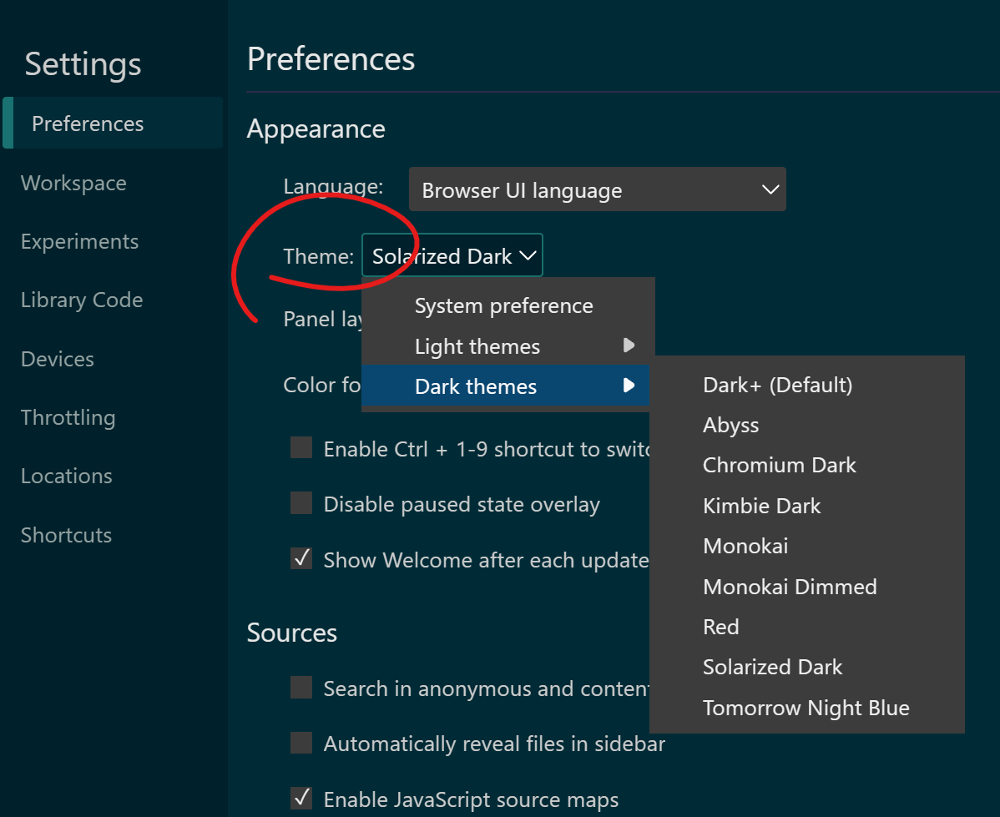

Chrome, Firefox and Safari all have a light and dark theme for their DevTools. On top of these two themes, Edge also has about 10 VS Code themes such as Monokai and Solarized Dark.

To change the theme based on your preference:

* In Firefox:
  * Open the **Settings** page (press <kbd>F1</kbd>).
  * In the **Themes** setting, choose between **Light**, **Dark**, or **Auto** to match the theme of your operating system.
* In Chrome:
  * Open the **Settings** page (press <kbd>F1</kbd>).
  * In the **Preferences** section, under **Appearance**, use the **Theme** dropdown to choose between **Light**, **Dark**, or **System preference** to match the theme of your operating system.
* In Edge:
  * Open the **Settings** page (press <kbd>F1</kbd>).
  * In the **Preferences** section, under **Appearance**, use the **Theme** dropdown to choose one of the available **Light** or **Dark** themes, or **System preference** to match the theme of your operating system.
* In Safari:
  * Open the **Settings** page (press <kbd>F1</kbd>).
  * In the **Appearance** section choose between **Light**, **Dark**, or **System**.

