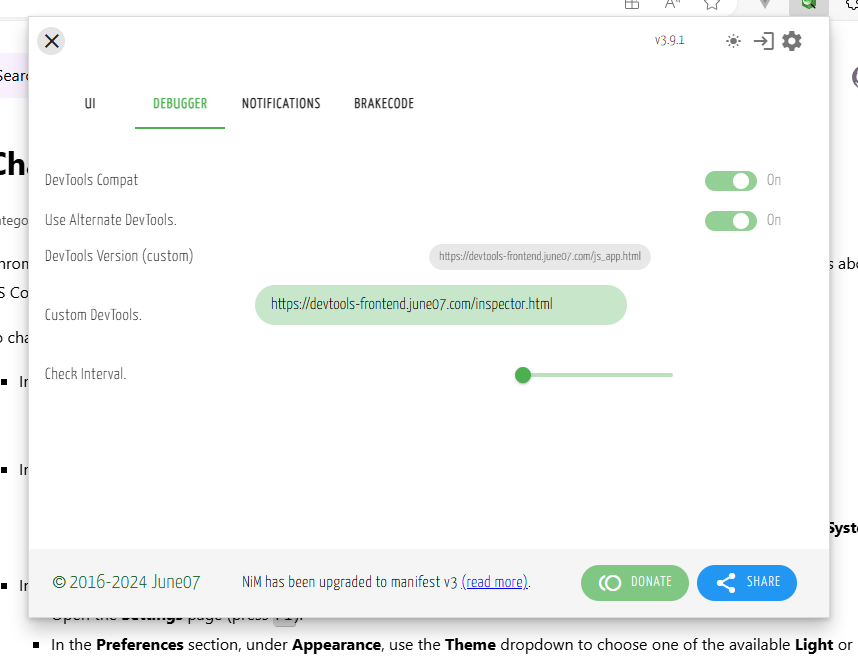
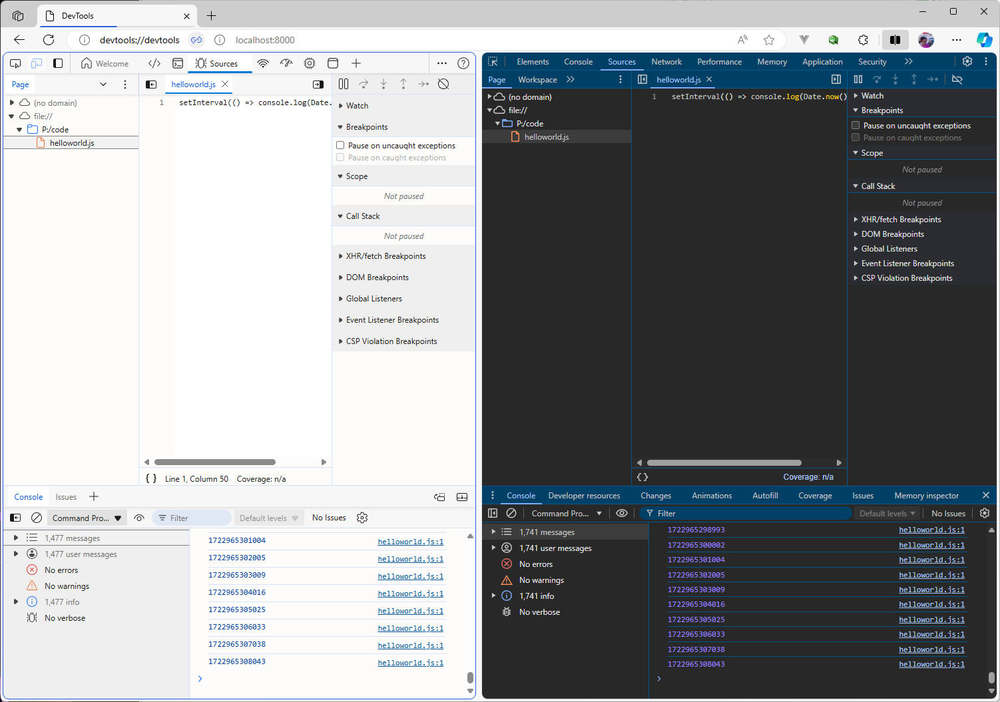

**Dynamically Switch Between DevTools Versions to Debug Node.js**

Dynamically swap out DevTools versions when debugging Node.js and other V8 runtime code.

By using [NiM](https://nim.june07.com), you can leverage different versions of DevTools, either served locally or remotely, without having to worry about upstream bugs or issues that might be present in the pinned version of DevTools per your current Chromium (Chrome, Edge, etc) browser version.

This means that you can customize your development environment to suit your needs, and switch between different versions of DevTools as needed.

**To use it**

* Install the NiM browser extension:
    * Chrome Web Store: https://chromewebstore.google.com/detail/nodejs-v8-inspector-manag/gnhhdgbaldcilmgcpfddgdbkhjohddkj
    * Edge Add-Ons: https://microsoftedge.microsoft.com/addons/detail/nodejs-v8-inspector-ma/injfmegnapmoakbmnmnecjabigpdjeme

* Set your devtools endpoint in NiM's settings

**Using Edge DevTools AND Chromium Devtools**

You can find out much more about this tool in [this blog post](june07.com/flexibility/)