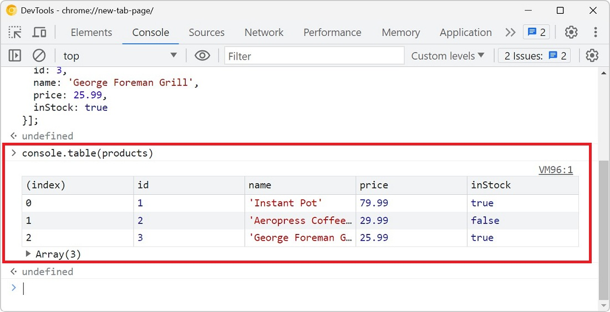

You probably know about `console.log()` already, it's a great way to print variables and objects to the console while the code is running, to debug it. But there are other console methods that can help you debug your code even more easily (you can [list them all](./list-console-functions.md) by the way).

## console.table

`console.table()` is great to print arrays and objects in a tabular format.

Say you have the following data:

```json
const products = [{
  id: 1,
  name: 'Instant Pot',
  price: 79.99,
  inStock: true
}, {
  id: 2,
  name: 'Aeropress Coffee Maker',
  price: 29.99,
  inStock: false
}, {
  id: 3,
  name: 'George Foreman Grill',
  price: 25.99,
  inStock: true
}];
```

You can log it to the console a much more readable way with `console.table()` by using the following code: `console.table(products);`



You can even [customize the table columns that are shown](./customize-console-table-columns.md).

## console.group

When your code generates a lot of logs, it can quickly become difficult to read those logs in the console.

`console.group()` allows you to group console logs together and indent them in a nice collapsible section, making them easier to read.

Take the following code example that generate a lot of logs:

```js
for (const product of products) {
  console.log(product.id);
  console.log(product.name);
  console.log(product.price);
  console.log(product.inStock);
}
```


Now let's use `console.group()` to group those logs together:

```js
for (const product of products) {
  console.group(product.name);
  console.log('ID:', product.id);
  console.log('Price:', product.price);
  console.log('In stock:', product.inStock)
  console.groupEnd();
}
```


## console.assert

Finally, the `console.assert` method allows you to log an error to the console only if some predefined condition is not met.

Let's say you want to make sure that all products in the `products` array are in stock and log an error if not.

You could use an `if` statement and `console.error`, like this:

```js
products.forEach(product => {
  if (!product.inStock) {
    console.error(`${product.name} is not in stock`);
  }
});
```

Using `console.assert` requires less code:

```js
products.forEach(product => {
  console.assert(product.inStock, `${product.name} is not in stock`);
});
```


That's it!

Credits go to [Suze Shardlow](https://suze.dev/blog/debugging-javascript-beyond-console-log/) for sharing this on her site.
