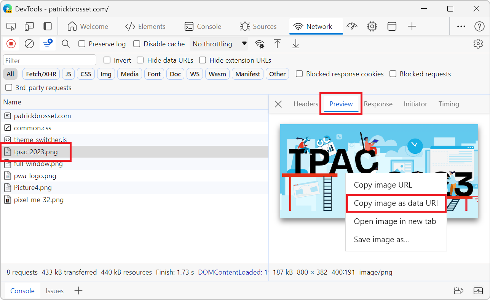

A data URL is a URL that starts with the prefix `data:` instead of `http:` or `https`. This data prefix (or scheme) allows you to embed the actual content of the resource in the URL itself, rather than linking to it. For example `data:text/html,<h1>Hello world</h1>` is a data URL that contains HTML content directly. Try it out in a browser tab!

Images can also be encoded as data URLs. Here is a 2x2 pixel solid red PNG image as a data URL: `data:image/png;base64,iVBORw0KGgoAAAANSUhEUgAAAAIAAAACCAYAAABytg0kAAAAEklEQVQIW2P8z8AARAwMjDAGACwBA/+8RVWvAAAAAElFTkSuQmCC`.

It can sometimes be useful to convert images to their data URLs, for example when you want to embed the images in a standalone HTML document that doesn't make any server requests.

To convert any image to a data URL:

* In Firefox:

    1. Open the image you want to convert in a new tab. Or open the webpage that contains the image you want to convert in a tab.
    1. Open DevTools.
    1. Open the **Elements** tool.
    1. Find the image you want to convert in the DOM tree and right-click it.
    1. Select **Copy** > **Image Data-URL**.

* In Chrome or Edge:

    1. Open the image you want to convert in a new tab. Or open the webpage that contains the image you want to convert in a tab.
    1. Open DevTools.
    1. Open the **Network** tool.
    1. Find the image you want to convert in the list of requests and click it.
    1. Click the **Preview** tab in the sidebar.
    1. Right-click on the image preview and select **Copy image as data URI**.

