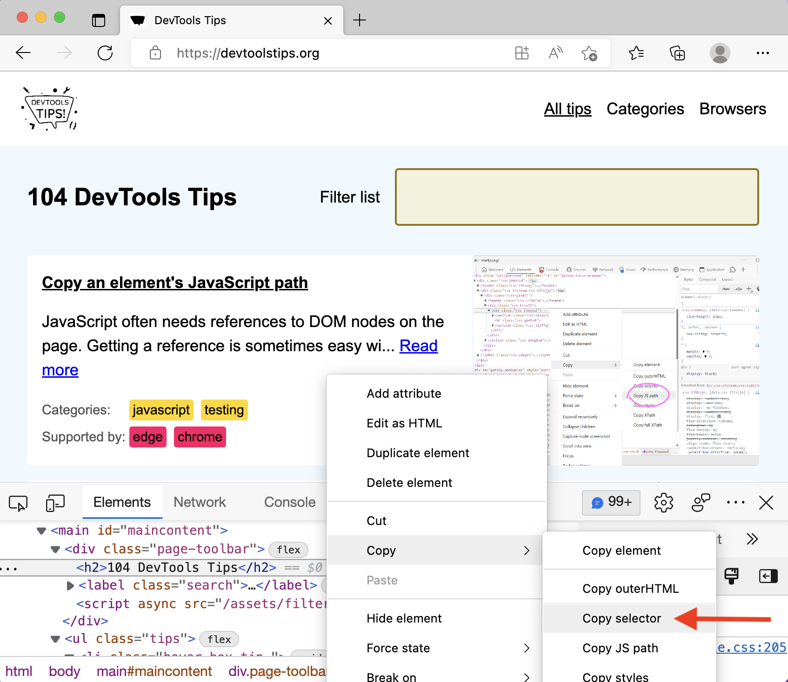

To uniquely identify an element that lacks an identifier, so that you can reference the element in JavaScript and other places, use DevTools' ability to copy unique CSS selectors.

All DevTools have the option to build a unique CSS selector for an element and then copy it to the clipboard:

- In **Chrome** and **Edge**:

  In the **Elements** tool, right-click an element, and then select `Copy` > `Copy selector`.

- In **Firefox**:

  In the **Inspector** tool, right-click an element, and then select `Copy` > `CSS Selector`.

- In **Safari**:

  In the **Elements** tool, right-click an element, and then select `Copy` > `Selector Path`.

- In **Polypane**:

  In the **Elements** panel, right-click an element, and then select `Copy Selector`.

This copies a unique CSS selector for the element, which you can then use in your JavaScript code, for example, to reference the element:

```javascript
document.querySelector("#maincontent > div > h2");
```


