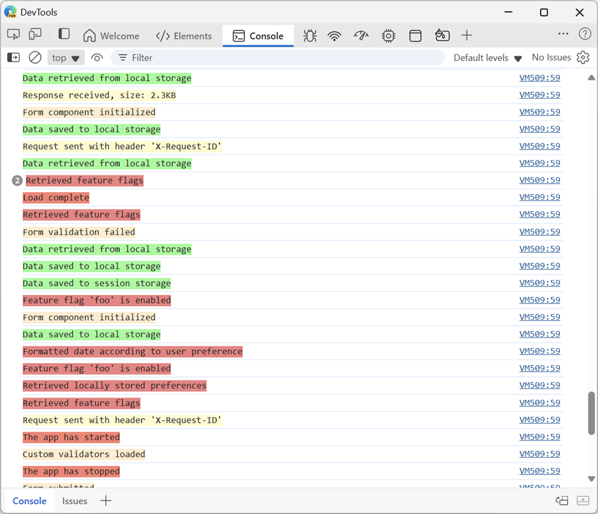
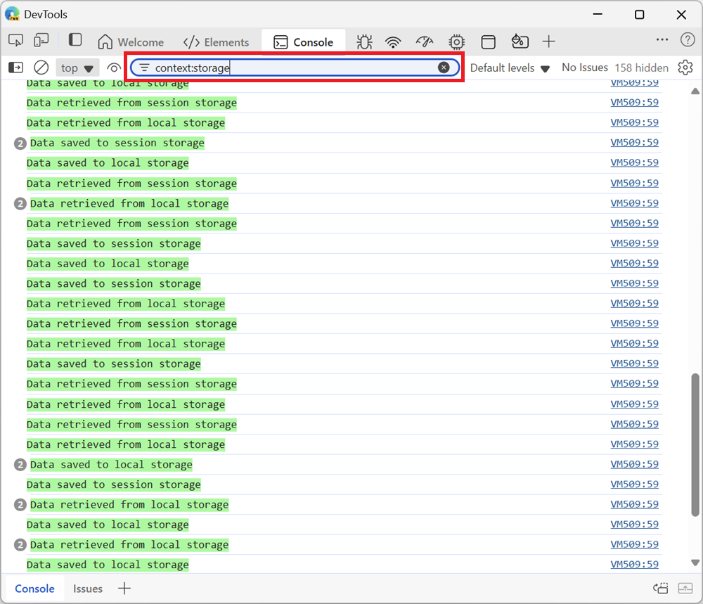

Applications are often made up of multiple subsystems or components, each with its own set of log messages. When you're debugging such an application, it might be hard to find the logs you're looking for in the **Console** tool, as the logs from all of the different parts of the app are mixed together.

`console.context()` can help you with this. This console API is an experiment in Chromium-based browsers only, but is a good step in the right direction.

1. Create a specific logger instance for a part of your app:

   `const myComponentLogger = console.context("name-of-my-component");`

1. Then log messages as normal, using your new logger:

   `myComponentLogger.log("This is a log message from my component");`

   `myComponentLogger.warn("This is a warning message from my component");`

   For an even nicer experience, give your logger a color:

   `myComponentLogger.log("%cThis is a log message from my component", "background-color:lemonchiffon;");`

   Here is what the **Console** tool might look like, with the logs from all of the components of the app:

   

1. When reviewing logs in the **Console** tool, filter the messages by using the name of the context:

   * Click **Filter** to focus the search field.

   * Enter **context:name-of-my-component** to see only the logs from your component.

   Here is what the **Console** tool would show, once the logs have been filtered by context, to show only the logs from one component:

   
