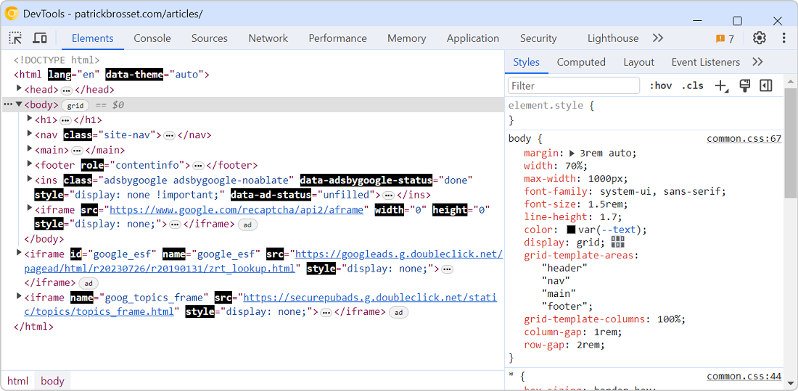

You can change the color theme of DevTools to match your preference (see [Change the color theme of DevTools](./change-color-theme.md) to learn more), but you can also create your own theme from scratch by creating a browser extension.

The process is a little bit complicated, and you will need to keep up with any DevTools changes that may break your custom styles, but it's a great way to make DevTools your own. And by creating it as an extension, it also means you can share it with others.

### Create an extension

First, you need to create a browser extension that will load your custom styles in DevTools. This extension is different from traditional browser extensions in that it doesn't create any new UI element in the browser.

1. Create a directory for your extension.

1. In your extension directory, create a `devtools.html` file which is only used to load a JavaScript file:

    ```html
    <script src="devtools.js"></script>`.
    ```

1. Also create the `devtools.js` file. This is where you'll load the custom styles:

    ```js
    fetch(chrome.runtime.getURL('devtools.css')).then(response => {
      response.text().then(text => {
        chrome.devtools.panels.applyStyleSheet(text);
      });
    });
    ```

1. Now, create the `devtools.css` file. This is where you'll write your custom styles. For example:

  ```css
  .webkit-html-attribute-name {
    font-weight: bold;
    color: white;
    background: black;
  }
  ```

  To help you get started with which styles you can override in your custom stylesheet, see [Inspect DevTools with DevTools](./inspect-devtools-with-devtools.md).

1. Finally, create a `manifest.json` file to load the DevTools page:

    ```json
    {
      "name": "My DevTools theme",
      "version": "1.0",
      "manifest_version": 3,
      "devtools_page": "devtools.html"
    }
    ```

### Enable custom DevTools themes

By default, DevTools doesn't load custom themes created by browser extensions. To enable this:

1. Open DevTools.
1. Open the **Settings** page by pressing <kbd>F1</kbd>.
1. In the sidebar, click **Experiments**.
1. Enable **Allow extensions to load custom stylesheets**.
1. Close the **Settings** page and reload DevTools.

### Load your extension

To test locally, you can load your extension as an unpacked extension:

1. Open the `about:extensions` page in Chrome or Edge.
1. Enable the **Developer mode** toggle.
1. Click **Load unpacked**.
1. Browse to your extension's directory and select this folder.
1. Open a new tab on any website and open DevTools.

Here is what the example code above looks like in Chrome DevTools:


