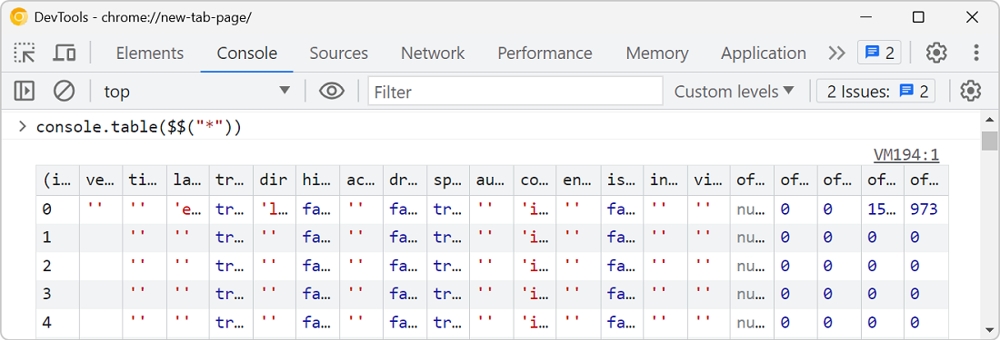

The [`console.table`](./console-table-group-assert.md) method is great for displaying tabular data in the console, but what if the objects your're logging contain a lot of properties, causing a lot of columns to appear in the console?

For example, let's log all DOM elements on a page with `console.table($$("*"))`:

You can actually customize the columns that are shown in the table by passing an array of strings as a second argument to `console.table()`. This array should contain the names of the properties you want to display.

Let's log all DOM elements on the page as before, but this time, let's pass an array containing just the few properties we want to display for each element: `console.table($$("*"), ["tagName", "id", "className"]);`:

