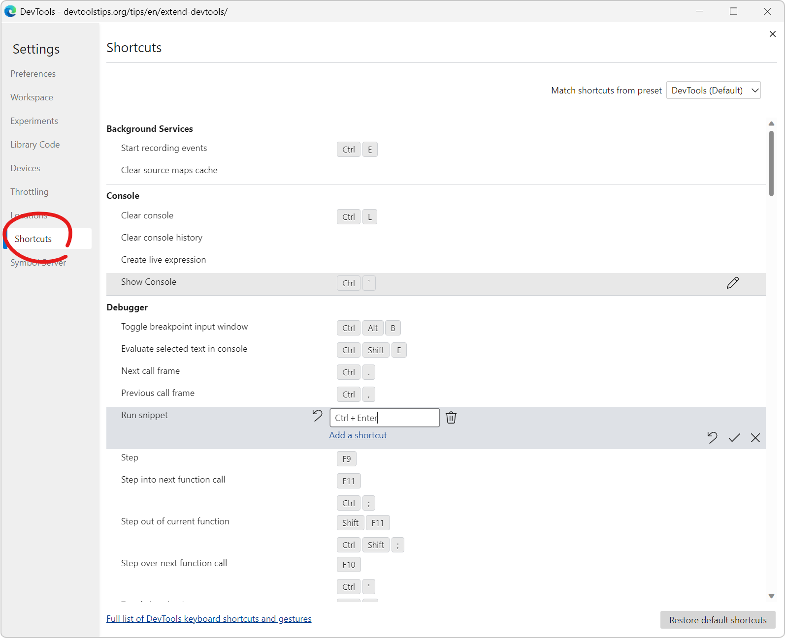

DevTools comes with tons of keyboard shortcuts. Some are well known (like `F12` to open DevTools), but there are many others which you might not be familiar with, and which could make your life easier.

Chrome and Edge have a screen where you can not only find all of the keyboard shortcuts, but also **customize** them. Chrome enabled this screen in version 107, and Edge has had it for a longer while.

To list the shortcuts:

1. Open DevTools (`F12`).
1. Go to the Settings by pressing `F1`.
1. Click **Shortcuts** in the sidebar.

You can also find the full list of shortcuts here: [Edge](https://learn.microsoft.com/microsoft-edge/devtools-guide-chromium/shortcuts/), [Chrome](https://developer.chrome.com/docs/devtools/shortcuts/), [Firefox](https://firefox-source-docs.mozilla.org/devtools-user/keyboard_shortcuts/index.html), [Safari](https://webkit.org/web-inspector/keyboard-shortcuts/).

To customize the shortcuts:

1. Hover one of the shortcuts and click the edit icon (the icon looks like a pencil).
1. Press the new key combination you want for this shortcut.
1. You can then save the new shortcut, cancel your change, or revert to the shortcut's initial value.

