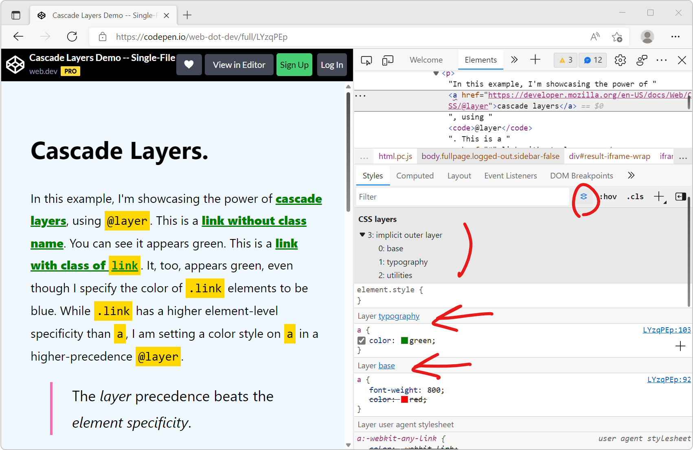

[Cascade layers](https://developer.mozilla.org/docs/Learn/CSS/Building_blocks/Cascade_layers) is a CSS feature that allows web developers to define their CSS styles in multiple layers and control the order in which these layers apply. Cascade layers are meant to bring an elegant solution to problems we've historically been fixing by using `!important` or artificially making selectors have higher specificity. To learn more about cascade layers, check out [Miriam Suzanne's complete guide on CSS Tricks](https://css-tricks.com/css-cascade-layers/).

In this tip, let's see how to visualize and debug layers in DevTools. All browser DevTools have support for layers in their **Styles**/**Rules** panels, and some browsers have more advanced features.

### All browsers

1. Open a page that uses cascade layers like [this one](https://codepen.io/web-dot-dev/full/LYzqPEp).
1. Inspect an element which has styles defined in one of the cascade layers like one of the green links in the above demo.
1. In the sidebar where CSS rules are displayed (called **Styles** or **Rules** depending on the browser), the rules are sorted by cascade layers, with the highest priority layer at the top, and lowest priority at the bottom.
1. Rules that are part of a cascade layer have a `@layer <layername>` label next to them.

### Chrome and Edge only

On top of the above, Chrome and Edge have a **Layers** view that shows the cascade layers in a list:

1. Open a page that uses cascade layers like [this one](https://codepen.io/web-dot-dev/full/LYzqPEp).
1. Inspect an element which has styles defined in one of the cascade layers like one of the green links in the above demo.
1. Click the **Toggle CSS layers view** button in the **Styles** panel toolbar (next to the search field) to reveal the list of layers.

### Polypane only

Polypane also has a **CSS Layers** view that shows the cascade layers in a list:

1. Open a page that uses cascade layers like [this one](https://codepen.io/web-dot-dev/full/LYzqPEp).
1. Inspect an element which has styles defined in one of the cascade layers like one of the green links in the above demo.
1. Click **CSS Layers** in the **Elements** panel to reveal the list of layers. The layers that are not dimmed in the list apply to the currently selected element.

