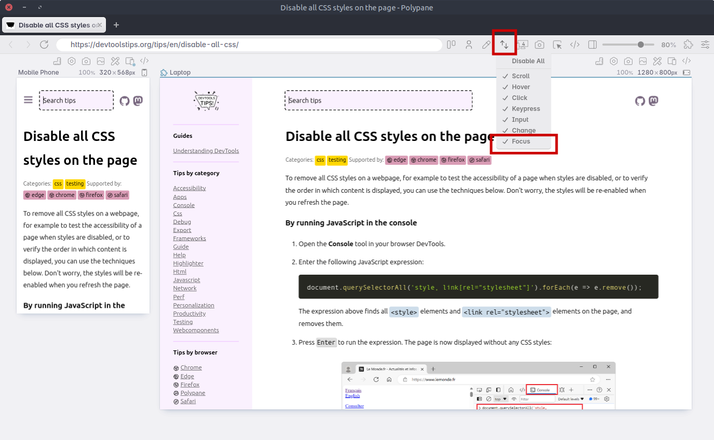

As described in [Debug popups that appear on hover using JS](./debug-js-hover.md) and in [Debug popups that appear on hover using the debugger statement](./debug-js-hover-2.md), there are ways to debug popups that appear on hover using JavaScript.

The main problem in debugging overlay elements, like popups, is that they disappear as soon as the page loses focus, for example after moving focus to the DevTools window. Use the techniques below to keep focus on the webpage while using DevTools.

## In Chrome or Edge

Chromium-based browsers, such as Chrome and Edge, provide a way to emulate a focused state on the webpage even if DevTools has focus.

To emulate a focused state on the webpage:

1. Open the **Command Menu** (`Cmd+Shift+P` or `Ctrl+Shift+P`).
1. Type **rendering** and select the **Show Rendering** command. The **Rendering** tool appears at the bottom of DevTools.
1. In the **Rendering** tool, scroll down and check the **Emulate a focused page** option. The webpage now has focus.
1. Use DevTools to inspect and debug elements that only appear when focus is in the webpage.

## In Polypane

Polypane provides a way to retain the focus state inside each pane. To retain the focus:

1. Right-click on the **Sync** icon in the toolbar.
1. Check the **Focus** option. The focus in now retained in all panes, and also kept in sync across all panes.

