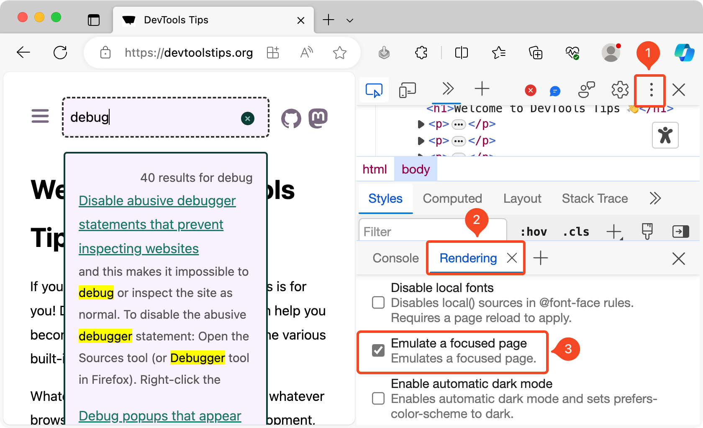

We had previously described a [couple](https://devtoolstips.org/tips/en/debug-js-hover/) [of](https://devtoolstips.org/tips/en/debug-js-hover-2/) ways to debug popups that appear on hover using JavaScript. The main problem in debugging overlay elements like popups is that they disappear as soon as the page loses focus after activating the DevTools window.

Chromium-based browsers like Chrome, Edge etc., provides a way to emulate a focussed page while the DevTools is active. Following are the steps

1. Open the **Command Menu** (`Cmd+Shift+P` or `Ctrl+Shift+P`) > Run "Show Rendering" to open the **Rendering** drawer.
2. Scroll down and select **Emulate a focused page** option to keep the page focussed.
3. Now you can to use the DevTools to inspect and debug the popup like any other part of the page.

