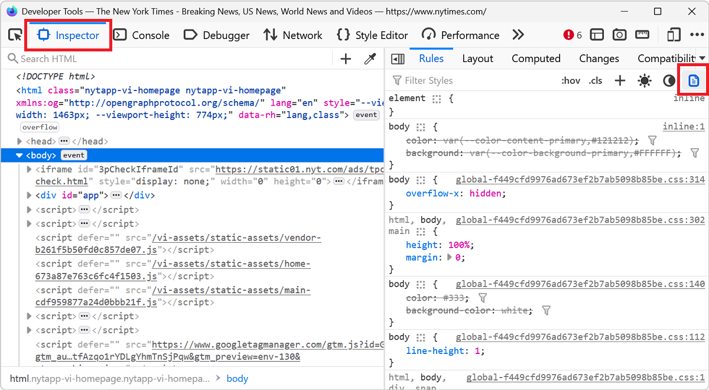
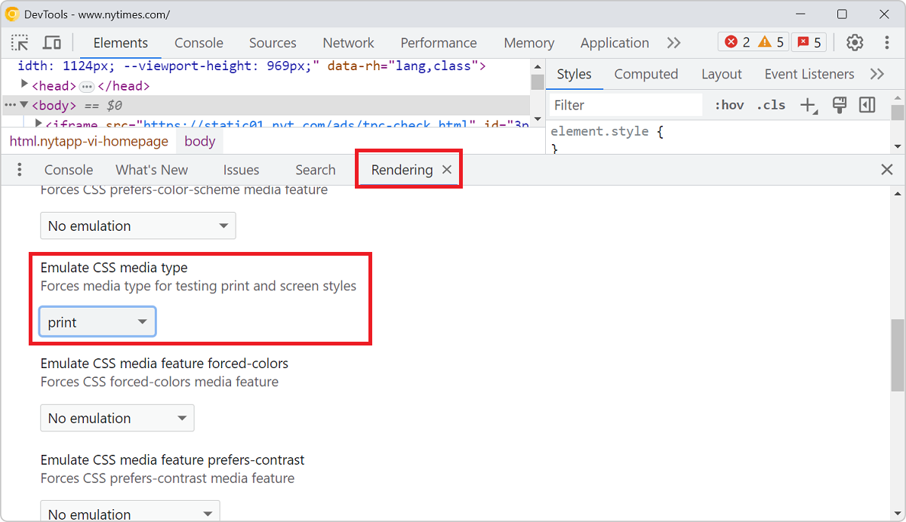
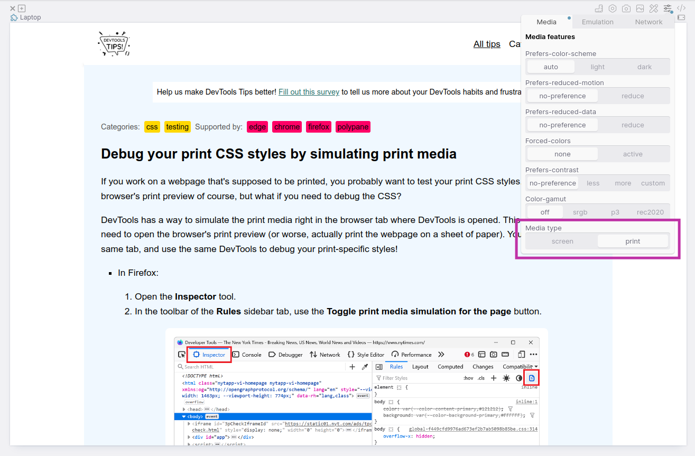

If you work on a webpage that's supposed to be printed, you probably want to test your print CSS styles. You can use your browser's print preview of course, but what if you need to debug the CSS?

DevTools has a way to simulate the print media right in the browser tab where DevTools is opened. This way you don't need to open the browser's print preview (or worse, actually print the webpage on a sheet of paper). You can stay in the same tab, and use the same DevTools to debug your print-specific styles!

* In Firefox:

    1. Open the **Inspector** tool.
    1. In the toolbar of the **Rules** sidebar tab, use the **Toggle print media simulation for the page** button.

    

* In Edge or Chrome:

    1. Open the **Rendering** tool (you can access it easily by using the [**Command menu**](./execute-commands.md) and typing "Rendering").
    1. Scroll down to the **Emulate CSS media type** drop-down.
    1. Choose the **Print** option.

    

* In Polypane:

    1. Open the **Emulation options**.
    2. Toggle **Media type** to "print".

    _Tip: open two panes side-by-side and set one to print media to compare the print and screen versions of your page._

     
    
* In Safari:

    1. In the **Elements** panel, click the printer icon in the toolbar at the top to force the page to use the print media styles.

    
