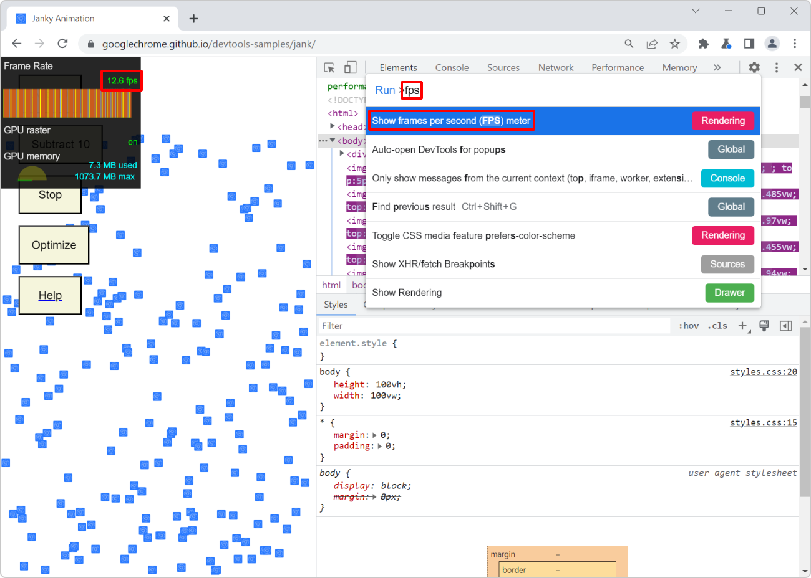

For a super smooth user experience on your website or app, it's better if the browser manages to render your page at a high framerate. Ideally, this rate should be 60 frames per second (FPS). This gives the browser 16ms to paint each frame. When the webpage doesn't do anything and the user is just reading the content, that's not hard to achieve. But if you have complicated JavaScript running and updating the page, then the browser has to squeeze a lot more work in these 16 ms frames.

A lower than 60 FPS framerate may lead to a degraded user experience where animations and page updates are noticeably janky and interactions feel slow. When debugging low framerate performance issues, it may help to display the current framerate on the screen.

In Chromium-based browsers, such as Edge or Chrome, it is possible to display an FPS meter on the screen:

1. Open the [Command Menu](./execute-commands.md): type <kbd>Ctrl+Shift+P</kbd> (or <kbd>cmd+Shift+P</kbd> on mac).
1. Type **FPS** to display the **Show Frames Per Seconds (FPS) Meter** command.
1. Press <kbd>Enter</kbd>.

The FPS meter appears in the upper left corner of the webpage, and displays the live framerate as you use the page. Use the Command Menu again to hide the FPS meter.

