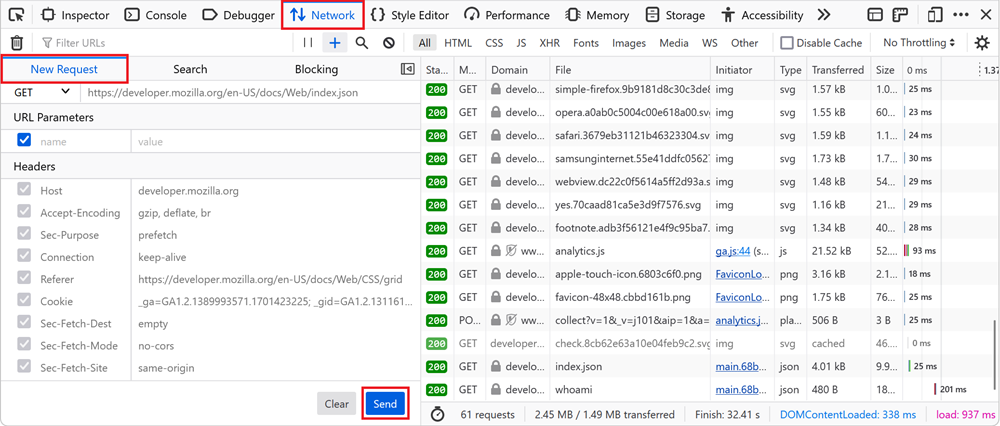
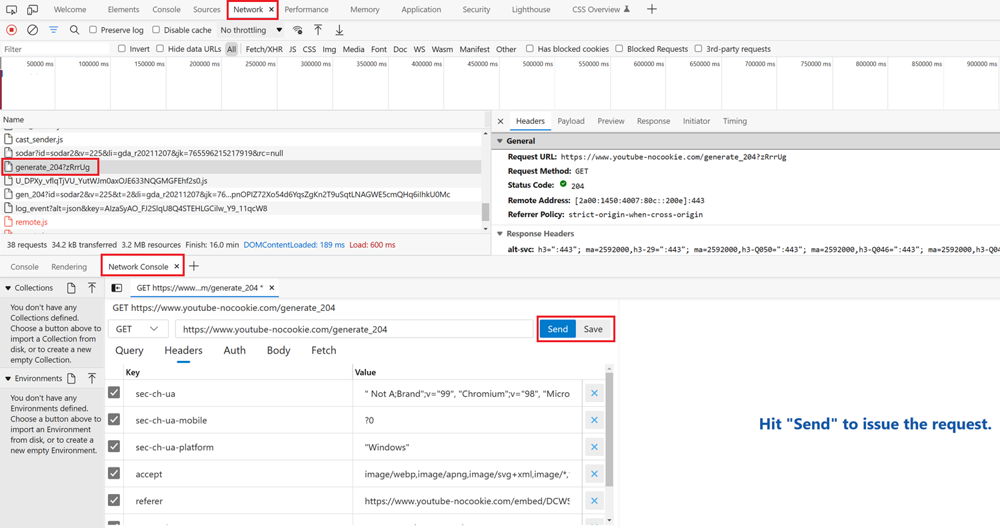

When you're investigating a bug where the backend you connect to doesn't respond with the right things it's useful to tweak the requests and try again quickly. You can do this by changing your frontend code, and reloading the page, but DevTools can help you go faster by letting you edit and then resend any request, without having to make any frontend code changes.

Below are a few ways to do this, depending on your browser of choice.

## Using cURL (Firefox, Chrome, Edge)

In Firefox, Chrome, or Edge, you can copy any request from the **Network** tool as a `cURL` command. Once copied, you can paste the command in your terminal app, edit it to match your needs, and then run it.

To copy a request as `cURL`:

1. Find the request you want to edit in the **Network** tool.
1. Right-click the request and select **Copy** > **Copy as cURL**.
1. Paste the command in your terminal app, make any changes you need, and then run it.

## Using fetch (Firefox, Chrome, Edge)

Similar to above, you can also to use the **Copy as Fetch** option in Firefox, Chrome, or Edege DevTools.

1. Find the request you want to edit in the **Network** tool.
1. Right-click the request and select **Copy** > **Copy as Fetch**.
1. Open the **Console** tool.
1. Paste the copied code in the **Console** tool, make any changes you need, and then run it.

## Using Firefox's Edit and Resend feature

Firefox has a built-in **Edit and Resend** feature that's very convenient because it doesn't require to switch to the terminal or to the **Console** tool. With **Edit and Resend**, you stay in the **Network** tool and can edit requests directly:

1. Find the request you want to test in the **Network** tool.
1. Right-click the request and select **Edit and Resend**. The **New Request** sidebar appears.
1. In the sidebar, edit the request's method, url, query string, headers, and body to match your needs
1. Click **Send** to resend the modified request.

## Using Edge's Network Console tool

Edge has a built-in feature very similar to Firefox's **Edit and Resend** named **Network Console**. This feature lets you edit and resend requests, but also allows you to create any number of requests to test, like [Postman](https://www.postman.com/).

1. The easiest way to get started is by going to the **Network** tool and finding the request you want to test.
1. Right-click the request and select **Edit and Resend**. The **Network Console** tool appears.
1. Edit the method, url, query string, headers, body, and more to match your needs.
1. Click **Send**.
1. To test the same modified request in the future, save this request. You can find all saved requests in the **Network Console** tool.

