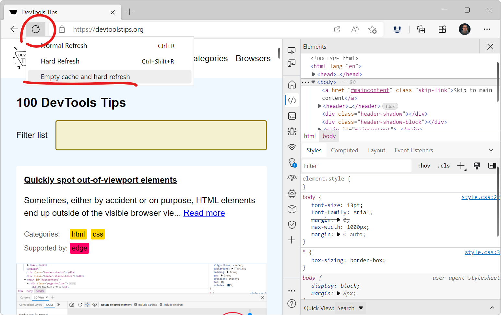

Here is a nice tip to quickly empty your cache and refresh the page, in order to test new code changes:

* In Chrome, or Edge, open DevTools (<kbd>F12</kbd>). This step is not needed for Polypane.
* Right-click on the page refresh icon, in the browser toolbar.
* Click **Empty cache and hard refresh**.

