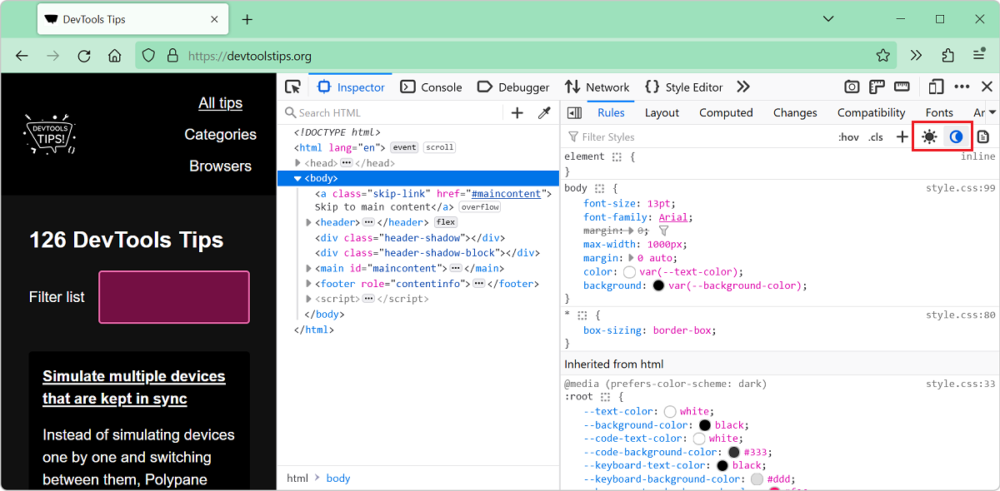
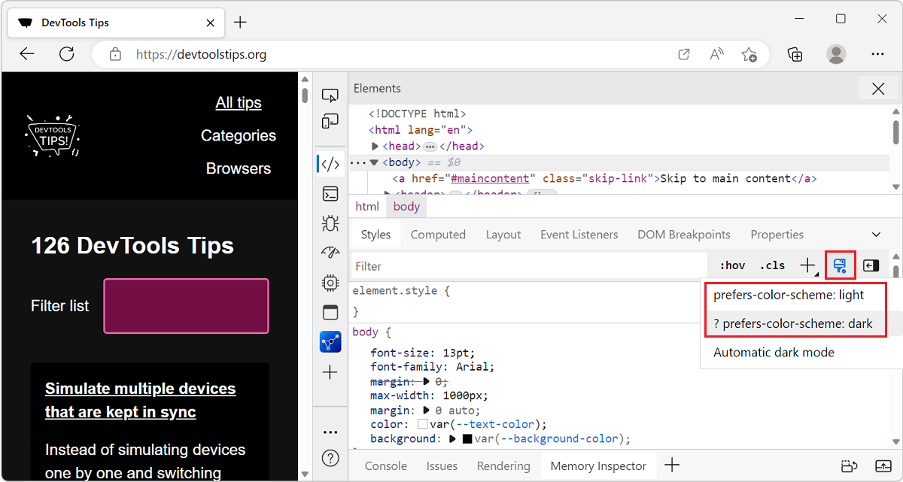
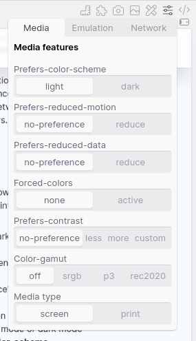

In CSS, you can use the `prefers-color-scheme` media feature ([docs](https://developer.mozilla.org/docs/Web/CSS/@media/prefers-color-scheme)) to detect if the user prefers using a light or a dark theme in their operating system. This is useful to style your website in a way that better blends with the rest of the operating system and respects the user's preference.

However, it can be a pain to test since you have to go in the operating system's settings and change the theme there. This can be slow and you might not actually want to change your entire theme just to test a website.

DevTools to the rescue! With DevTools, you can emulate a different color scheme just for the inspected page. All browsers support it, but it's slightly different in each one of them.

* In Firefox:

    1. Open the **Inspector** tool.
    1. In the toolbar of the **Rules** sidebar tab, use the light and dark color scheme buttons.

    

* In Edge or Chrome:

    1. Open the **Elements** tool.
    1. In the toolbar of the **Styles** pane, open the **Toggle common rendering emulations** menu (it looks like a paint brush).
    1. Choose one of the `prefers-color-scheme` options.

    

* In Safari:

    1. Open the **Elements** tool.
    1. In the toolbar of the tool, click the emulation button and choose a color scheme.

    

* In Polypane:

    1. Next to the pane you want to change, click the emulation icon in the pane header.
    1. Click the **Media** tab.
    1. Choose a scheme in the **prefers-color-scheme** toggle.

    
