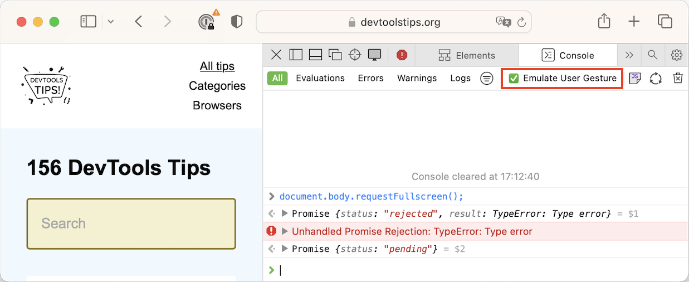

Certain web APIs are _user gesture_ restricted. This means that they can only be called as a result of a user action, such as in a click event handler.

For example, you can't simply put yout website in fullscreen mode by using `document.body.requestFullscreen()` in your JavaScript code. You're only allowed to do this if the user initiated the action. This is for security reasons and is all well and good.

However, it can be a pain when you need to test a user gesture restricted API in the **Console** tool of DevTools.

Thankfully, Chrome, Edge, and Safari let you do it:

* In Chrome or Edge, this is done by default. All JavaScript code you run in the **Console** is treated as a user action. You can, however disable this:

  * Go to the **Console** tool.
  * Click the **Console Settings** button in the top-right corner of the tool.
  * Clear the **Treat code evaluation as user action** setting.

* In Safari:

  * Go the **Console** tool.
  * Check the **Emulate User Gesture** setting in the toolbar.

And that's it! You can now use and test any APIs in the **Console**, including those that normally require a user gesture.
