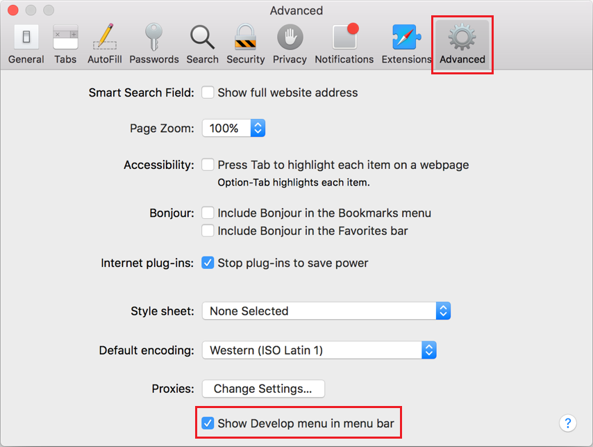

Unlike other browsers, Safari hides its DevTools (and other developer-related features) by default. That's actually good because 99% of the people using the browser are probably not web developers.

If you are a web developer, though, and you want to use the DevTools in Safari, here's how to enable the option:

1. Go to Safari's **Settings** or press `Cmd+,`.

1. Go to the Advanced tab.

1. Check the **Show features for web developers** option.

   This will add the **Develop** menu in the menu bar and the **Develop** tab in Settings. Use this menu to open DevTools and access other developer-related features.

   The right-click > **Inspect Element** option will also now be available.

