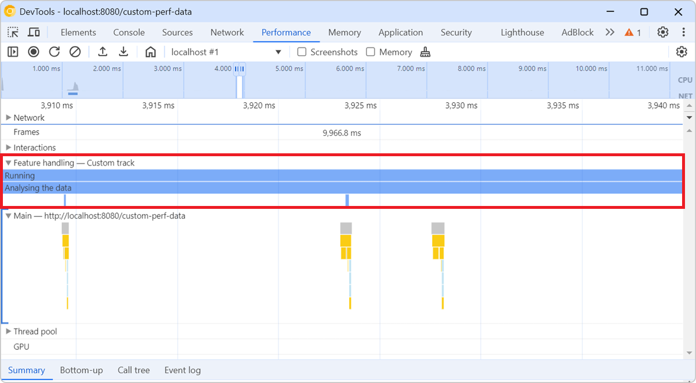

The **Performance** tool lets you add custom tracks with your own custom events, when recording performance traces. This is useful to surface your own performance data, which might not map directly to the functions defined in the code.

To extend traces, use the [Performance API](https://developer.mozilla.org/docs/Web/API/Performance_API) in your JavaScript code. For example, to start measuring a custom event, you can use `performance.now()` as shown below:

```javascript
const start = performance.now();
```

Then, later in your code, you can stop measuring that event, and display it in a custom track in the **Performance** tool:

```javascript
performance.measure(`Analyse`, {
  start: start,
  end: performance.now(),
  detail: {
    devtools: {
      dataType: "track-entry",
      // The name of the custom track.
      track: "Feature handling",
      // Custom properties of the event, displayed in the Summary pane, when the event is selected.
      properties: [["id", id], ["size", size]],
      // Tooltip text which appears when hovering over the event in the custom track.
      tooltipText: `Feature ${id}`,
    }
  }
});
```

When you later record a performance trace in the tool, a new track named **Feature handling** is displayed in addition to the **Main** track where the function call stacks and other browser rendering events are displayed. The custom events you added are displayed in this new custom track.


