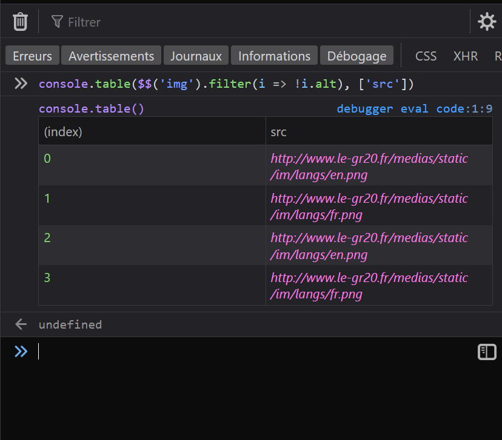

With HTML, you can add alternative text to images using the `alt` attribute. It can be used to add a text description to images, which is extremely useful for accessibility as some people may not be able to see the images. With `alt`, screen readers can announce the alternative text to the user.

Using DevTools, you can quickly check which images on a page do not have an `alt` text, here is how:

Execute this in the Console panel: `console.table($$('img').filter(i => !i.alt), ['src'])` and that's it! You'll have the list of image URLs that don't have an alternative text.

Here's what this command does:

* `$$()` find all elements that match a given CSS selector ([learn more here](./query-dom-from-console.md)). Here it is used to find all images.
* `filter()` is used to only keep the images that do not have an `alt` attribute.
* Finally, `console.table()` takes the array returned by `filter` and outputs a pretty table in the console based on it. Notice the second (optional) paramter that is used here to retrict the number of columns to just the `src` attribute from each image.

**In Polypane:**
1. Open the **outline panel**.
2. Select **Images**.
3. See which images in the list have an "Alt: missing!" warning.
4. (Optionally) click **Show overlay** to highlight the missing images on the page.

