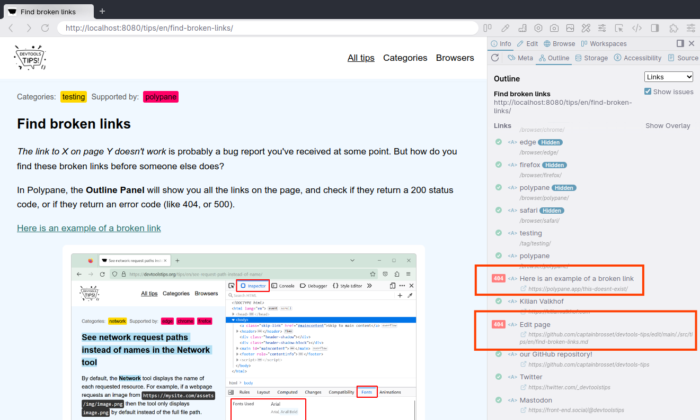

_The link to X on page Y doesn't work_ is probably a bug report you've received at some point. But how do you find these broken links before someone else does?

In Polypane, the **Outline Panel** will show you all the links on the page, and check if they return a 200 status code, or if they return an error code (like 404, or 500). 

Along with broken URLs, Polypane also finds unfinished/placeholder URLs like `mailto:` and `https://` without anything else after that text.