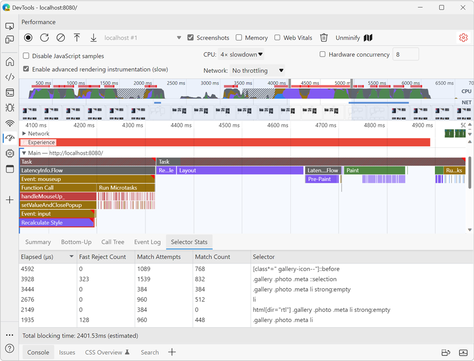

When it comes to performance, we often spend time improving our JavaScript code. But CSS has a role to play too.
CSS selectors, in particular, can sometimes be slow to match to the DOM of the page.

Before rewriting all of your CSS selectors based on some "guidelines" you might have found on the web, it's really important to measure the performance of your webpage first. Don't make your selectors unnecessarily complicated because someone somewhere said that a particular selector was slow. Instead, measure the performance of your page, make sure that CSS is having a negative impact, improve your code, and then measure again!

So, now, how do you know if CSS is having a negative impact, and how to tell which CSS selectors may be at cause?

Microsoft Edge has a very useful new feature starting with Edge version 110 called **Selector Stats** that can help with this. Here's how to use it:

1. Open the **Performance** tool in Edge.
1. Open the **Settings** of the tool by using the little cog icon in the top-right corner of the tool.
1. Check the **Enable advanced rendering instrumentation (slow)** box.
1. Start the perf recording, run through your scenario, and then stop the recording.
1. When the profile has loaded, identify the long **Recalculate Style** blocks (they are purple).
1. Click on one of them.
1. In the details section below, the **Selector Stats** tab appears, click on it.

You now have access to the list of CSS selectors that got matched against the DOM tree of the web page during this style recalculation task. You can sort the table by elapsed time or match count to get an understanding of which selectors needed the most time to run.

