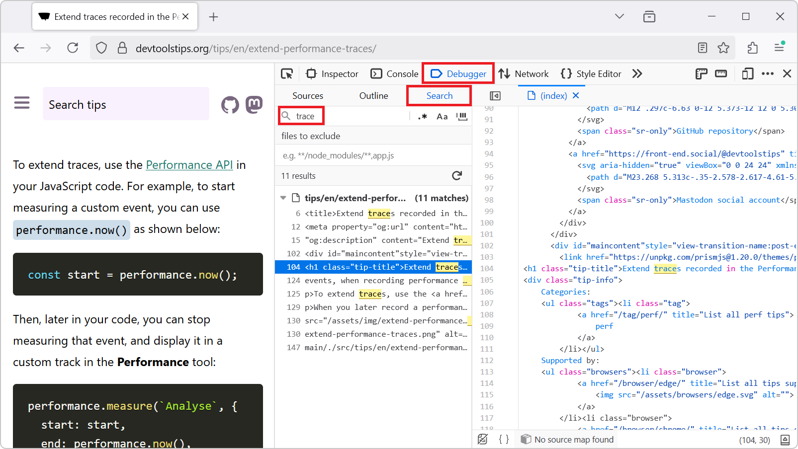

To find occurrences of a string in all of the files of the webpage you are inspecting, for example to find where a specific CSS class is defined, or where a specific JavaScript API is used:

* In Firefox:

  * Open the **Debugger** tool.

  * Press <kbd>Ctrl+Shift+F</kbd> (or <kbd>Cmd+Option+F</kbd> on macOS).

    The **Search** sidebar panel appears.

  * Enter the string you want to search for and then press <kbd>Enter</kbd>.

    The results are displayed in the **Search** sidebar panel.

    Results from CSS stylesheets don't appear in the results however. To find occurrences in CSS stylesheets, open the **Style Editor** tool and press <kbd>Ctrl+F</kbd> (or <kbd>Cmd+F</kbd> on macOS).
  
  * Click one of the results to display the file, at the right location, in the **Debugger** tool.

    

* In Chrome or Edge:

  * Press <kbd>Ctrl+Shift+F</kbd> (or <kbd>Cmd+Option+F</kbd> on macOS).

    The **Search** tool appears in the bottom drawer area.
  
  * Enter the string you want to search for and then press <kbd>Enter</kbd>.

    The results are displayed in the **Search** tool.

  * Click one of the results to display the file, at the right location, in the **Sources** tool.

    

* In Safari:

  _Missing content. Click **Edit this page**, at the bottom of the page, to add the missing content._

* In Polypane:

  _Missing content. Click **Edit this page**, at the bottom of the page, to add the missing content._
