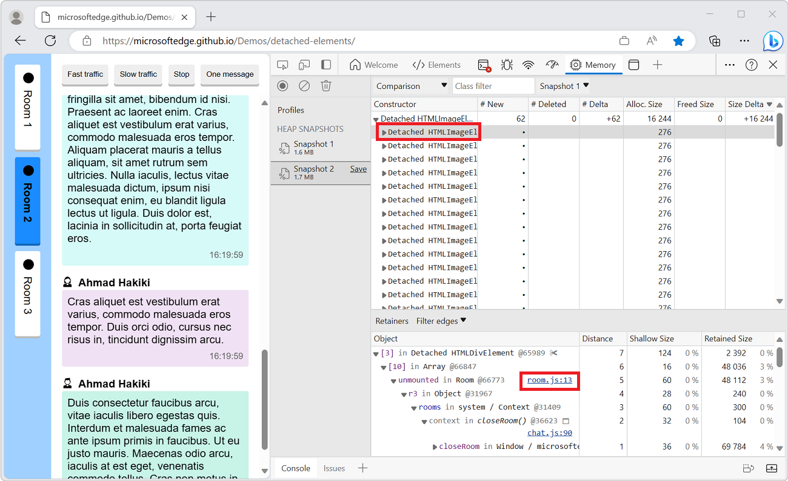

_**Note**: If you think your memory leak comes from DOM nodes, you can also use the  **Detached Elements** tool in Edge, see [Get detached DOM elements to investigate memory leaks](./get-detached-elements.md)._

Memory leaks are hard to find, and the **Memory** tool in DevTools can look pretty intimidating. But if you can reproduce the leak consistently, it helps to know about the tool's _Compare_ feature, which allows you to focus on just the differences between two heap snapshots and forget the rest.

To compare two heap snapshots:

1. In Chrome or Edge DevTools, open the **Memory** tool.

1. Before doing anything else, record a first heap snapshot. This will be your baseline against which you'll compare all other snapshots.

   To do this, make sure the **Heap snapshot** option is selected and click **Take snapshot** at the bottom.

1. Now, in the webpage, run the user scenario that creates the memory leak.

1. Back in the tool, record another heap snapshot by clicking the **Record heap snapshot** button in the top left corner.

1. With the new snapshot displayed, click the drop-down (which is currently set to **Summary**) and change its value to **Comparison**.

1. Verify that the second drop-down, to the right, has the first snapshot selected. If you record more snapshots, make sure you're comparing to the right baseline.

   

1. In this comparison view, sort by different columns to see how memory changed during the user scenario.

   Sort by the **Size Delta** column to see how much memory each object type has increased (or decreased) since the baseline snapshot. You can also sort by **New** and **Deleted** to see which objects have been created or deleted since the baseline.

1. Expand object types and click on individual objects to see more details in the **Retainers** panel at the bottom. You should be able to find references to your own code where objects were added, eventually leading to finding the root cause of the leak!

   
