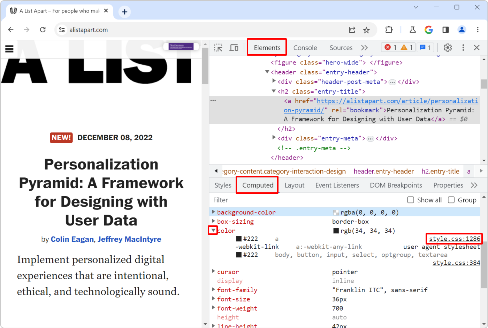
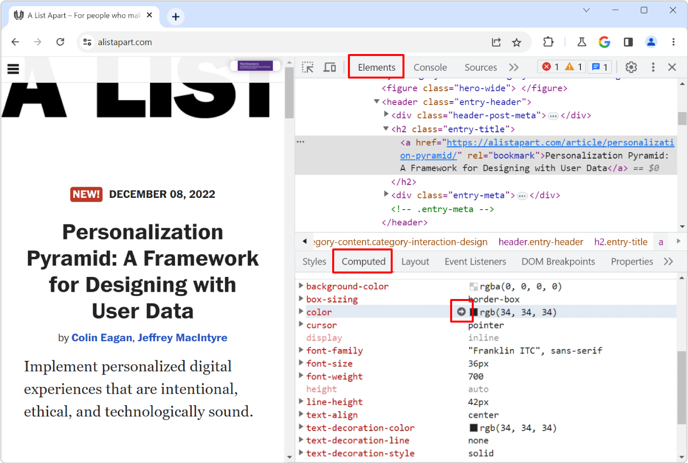

Here is the scenario: you know there's a specific style that applies to an HTML element in your web page, say some padding, but you can't seem to find where, in the CSS code, that style is coming from.

This can easily happen when working on a large codebase where a lot of CSS rules apply to the element you're looking at.

One neat way to help with this is to use the **Computed** panel:

1. Open DevTools, and select the element you're interested in.
1. In the **Elements** (or **Inspector**) tool, open the **Computed** sidebar panel.
1. In the list, search for the CSS property you are interested in, say `padding-bottom`.
1. Expand the little arrow next to the property name to see the CSS rule (or rules) that caused this style to be applied.
1. Click the first link in the list to jump to the actual location, in your code, where the rule is defined. In Firefox, you will end up in the **Style Editor** tool, and in Chromium-based browser the link will take you to the **Sources** tool.

Quick note: in Chrome and Edge only, you can also jump from the **Computed** panel to the right place in the **Styles** panel by clicking to the right of the property name:

