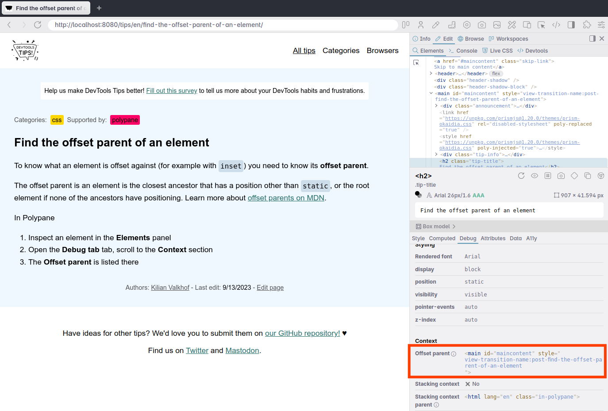

To know what an element is offset against (for example with `inset`) you need to know its **offset parent**. 

The offset parent is an element is the closest ancestor that has a position other than `static`, or the root element if none of the ancestors have positioning. Learn more about [offset parents on MDN](https://developer.mozilla.org/en-US/docs/Web/API/HTMLElement/offsetParent).

In Polypane

1. Inspect an element in the **Elements** panel
2. Open the **Debug tab** tab, scroll to the **Context** section
3. The **Offset parent** is listed there

  

