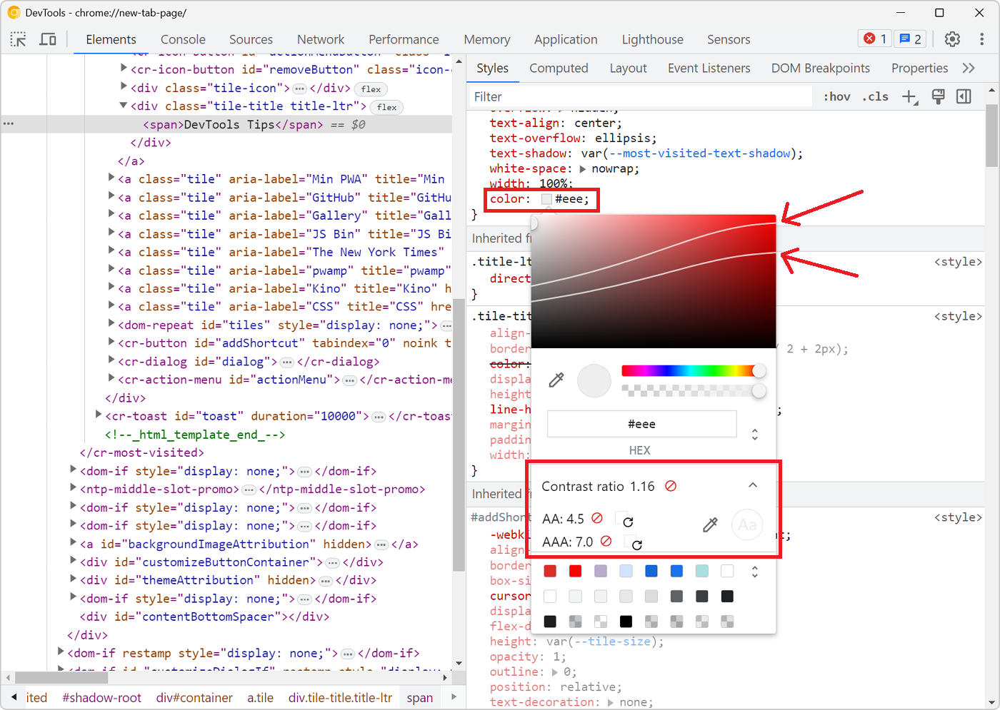

With DevTools you can [detect low color contrast issues](./detect-low-color-contrast.md) which is great. But Chrome DevTools, Edge DevTools, and Polypane, you can go one step further and fix these issues directly!

### In Chrome and Edge

Here is a tip shared on [dev.to](https://dev.to/domizajac/how-to-use-chrome-devtools-to-find-a-color-fixing-insufficient-color-contrast-ratio-on-your-html-element-546k) by [Domi](https://twitter.com/domizajac):

1. Find an element which text color doesn't have enough contrast with its background color.
1. Select this element in the **Elements** tool.
1. Click on the little color swatch next to the color value in the **Styles** pane.
1. A color picker will appear. Expand the **Contrast ratio** section.
1. A couple of useful lines appear in the color gradient. These lines represent the minimum contrast ratio required for the text to be readable.
1. You can also click on the little reload icons next to the AA and AAA labels in the **Contrast ratio** section to let DevTools suggest a color that would pass the AA or AAA requirements.

### In Polypane

In Polypane, these suggestions are made inline on the page itself when enabling the **Contrast checker debug tool**.

