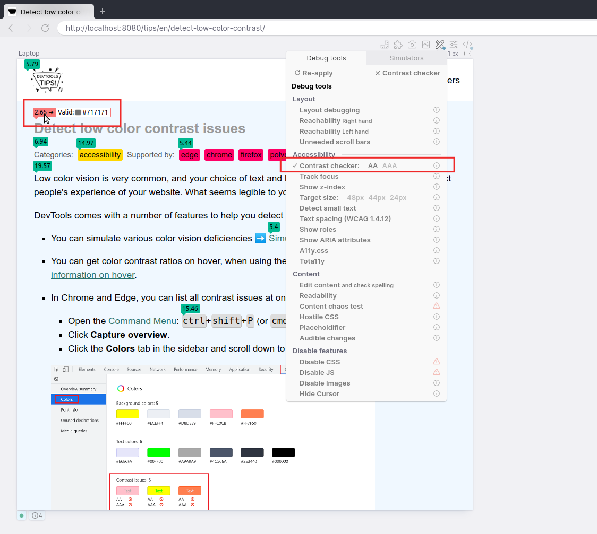

With DevTools you can [detect low color contrast issues](./detect-low-color-contrast.md) which is great. But DevTools in Chrome, Polypane and Edge go one step further and help you fix these issues too! [Domi](https://twitter.com/domizajac) tells us all about it.

https://twitter.com/domizajac/status/1507310081624444929

In Polypane, these suggestions are made inline on the page itself when enabling the **Contrast checker debug tool**.

