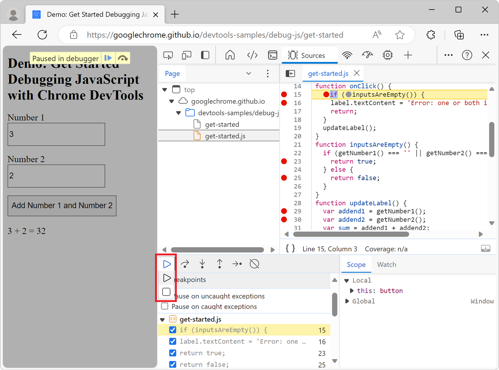
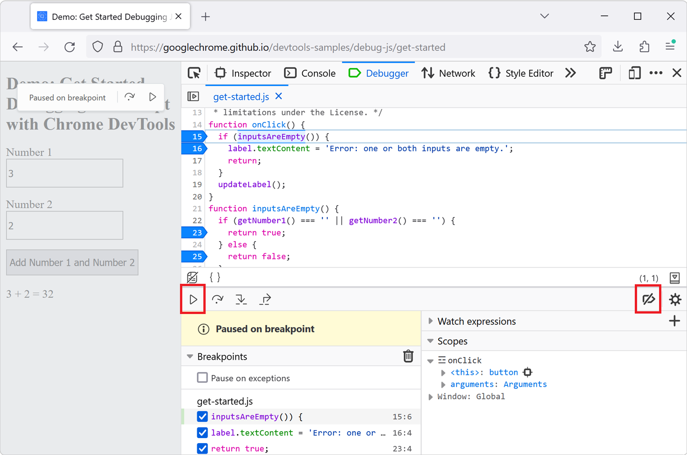

When using breakpoints to debug your JavaScript code, sometimes you end up setting many breakpoints in different functions. You might want to keep these breakpoints but not always pause at them.

There are two ways to do this in DevTools:

* Forcing execution, skipping over other breakpoints.
* Or temporarily deactivating breakpoints.

## Force execution

Forcing execution is only supported in Chrome and Edge:

1. Open the **Sources** tool.
1. Set all of the breakpoints that you need.
1. Once paused at your first breakpoint, click and hold the **Resume script execution** button and then select the **Force script execution** button. The script execution resumes, and doesn't pause at any other breakpoint.

## Temporarily deactivate breakpoints

In Chrome, Edge, and Firefox, you can temporarily deactivate breakpoints:

1. Open the **Sources** tool in Chrome or Edge, or the **Debugger** tool in Firefox.
1. Set all of the breakpoints that you need.
1. Once paused at your first breakpoint, click the **Deactivate breakpoints** button, and then click **Resume**. The script execution resumes, and doesn't pause at any other breakpoint.

