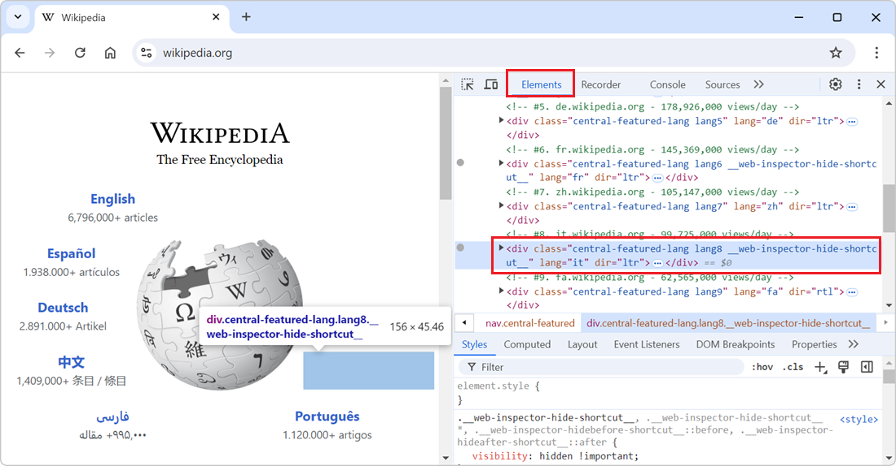
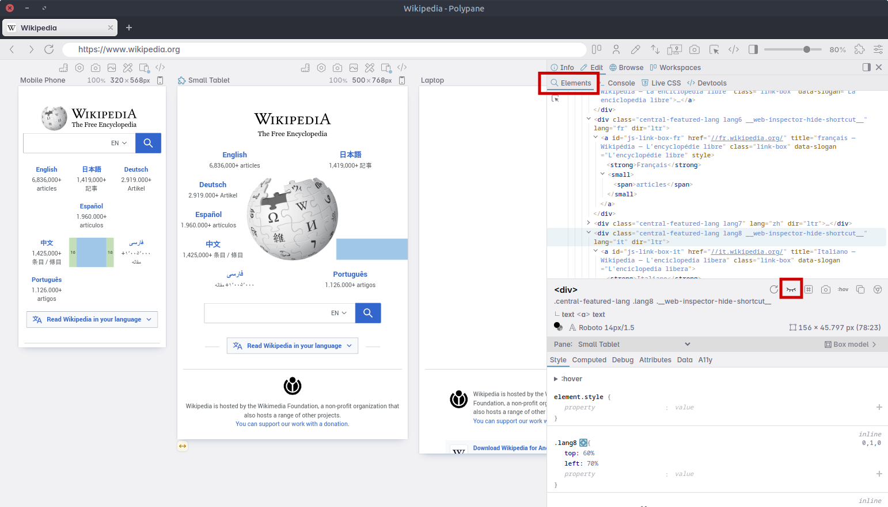

In the DevTools' **Elements** (or **Inspector**) tool, you can delete nodes from the DOM tree by selecting them in the tool and then pressing <kbd>Delete</kbd> or <kbd>Backspace</kbd>. While this is great to completely remove the elements and make others take more space for example, it can also break the CSS layout of the page.

Hiding elements without altering the DOM tree or the layout can be useful in some cases, such as:

* When elements overlap each other, and you want to see what's behind them.
* When you want to take a screenshot of the page without some information being visible.
* When you want to focus on just one part of the page without being distracted by other elements.

## In Chrome, Edge, or Firefox

To hide an element without removing it from the DOM tree, in DevTools:

1. Go to the **Elements** tool (called **Inspector** in Firefox).
1. Select the element you want to hide.
   
   * Either from the page, by right-clicking on it and selecting **Inspect**.
   * Or from the tool, by finding and clicking on the element in the DOM tree.

1. Press <kbd>H</kbd> on your keyboard.

   The element remains in the DOM tree, but becomes invisible in the page.

To show the element again, make sure it's selected in the **Elements**/**Inspector** tool, and press <kbd>H</kbd> again.

## In Polypane

1. Select the element you want to hide in the **Elements** panel.
1. Click the **Eye** icon in the toolbar.

   The icon changes from an open eye to a closed eye.

1. Click the icon again to show the element again.

