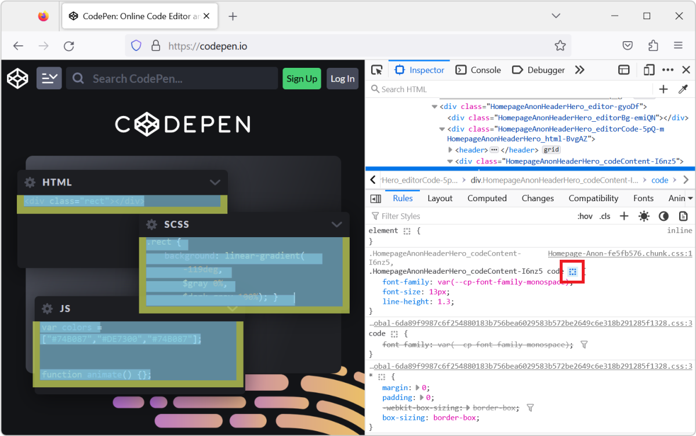
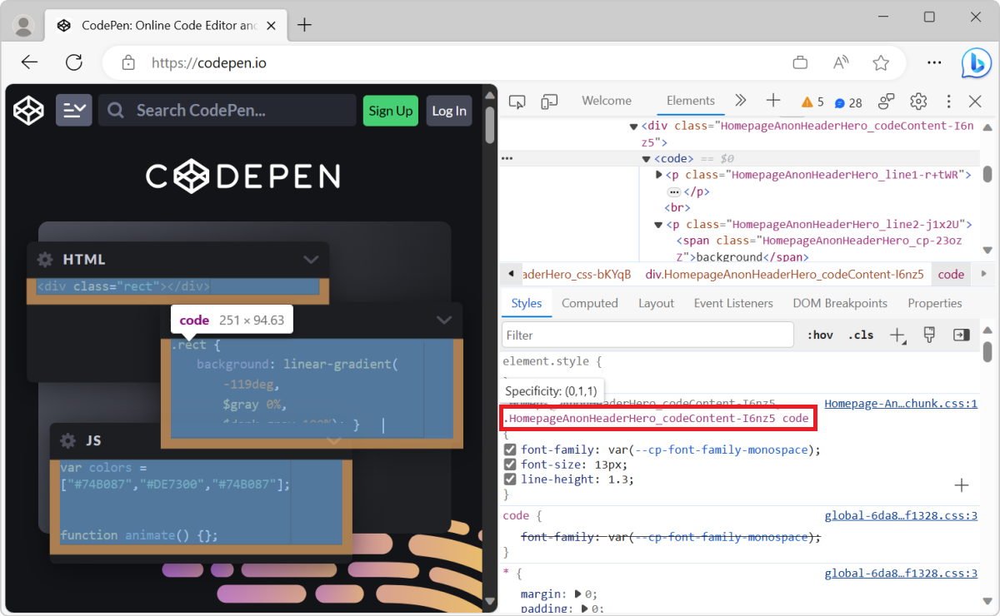
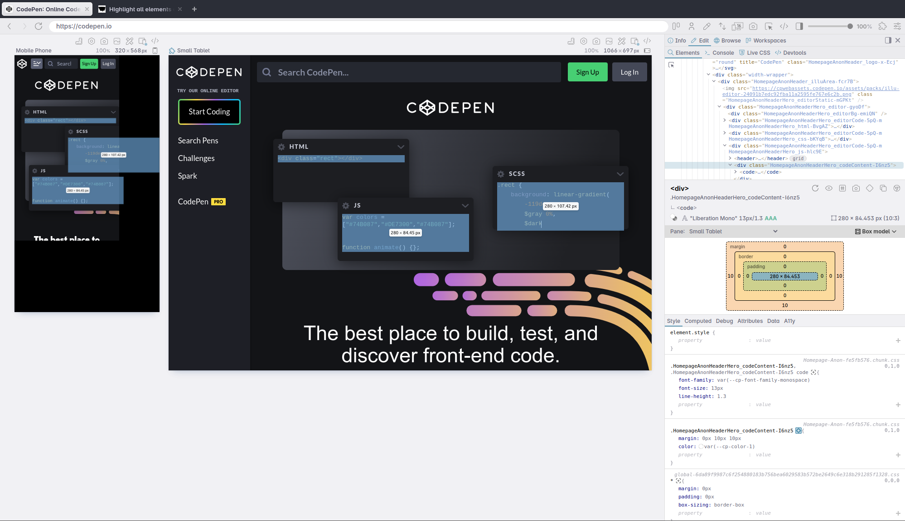

When you select an element in DevTools (in the **Elements** or **Inspector** tool), you see the CSS rules that apply to it. But, these rules can also apply to other elements in the page than the currently selected one.

To see all the elements that match a given CSS rule selector, and therefore know which elements will be impacted if you change that rule:

* In Firefox, select an element in the **Inspector** tool, then click the **Highlight all elements matching this selector** button next to a CSS rule in the **Styles** pane:

  

* In Chrome, Edge, or Safari, select an element in the **Elements** tool, then hover over a CSS selector in the **Styles** pane:

  

* In Polypane, select an element in the **Elements** panel, then click the **Highlight all elements matching this selector** button next to a CSS rule in the **Styles** tab:

  
