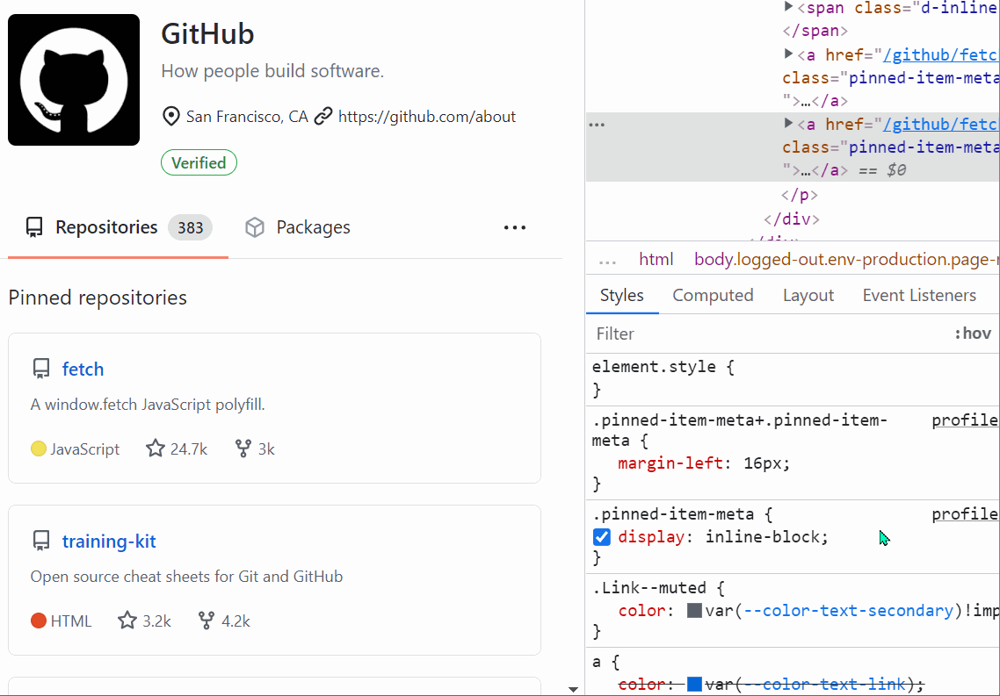

When you want to know which elements a given CSS rule will apply to, in addition to the currently selected element, you can:

* In Firefox:
  * In the Style Editor panel: hover over any rule selector for some time.
  * In the Rules panel: click on the selector icon next to any rule selector.
* In Chrome, Edge or Safari:
  * In the Styles panel: hover over any rule selector for some time.
* In Polypane:
  * In the Elements panel: Click the `[+]` icon next to each selector.

