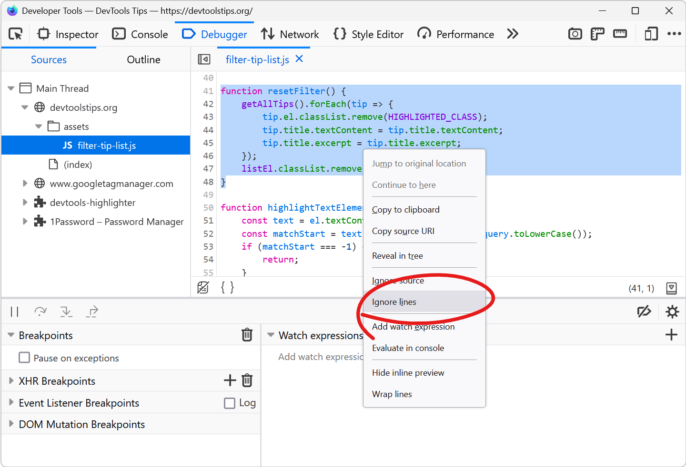

Debugging JavaScript can quickly get out of hand when you have a lot of code and many functions that call each other.

What's even worse is when a lot of this code isn't even yours. This can happen when you use frameworks or libraries. You don't really want to debug the library code, but sometimes it gets in the way when trying to step through your own code while using breakpoints.

To help with this, you can ignore third-party scripts (like library source files) in DevTools. When ignored, those files don't appear in your callstacks when debugging, and you don't step through them anymore.

* To ignore a script in Chrome or Edge: right-click anywhere in the file and click **Add script to ignore list**. Learn more on the [Chrome docs](https://developer.chrome.com/docs/devtools/javascript/reference/#ignore-list) or the [Edge docs](https://learn.microsoft.com/microsoft-edge/devtools-guide-chromium/javascript/reference#ignore-a-script-or-pattern-of-scripts).
* In Firefox: right-click in the file and click **Ignore source**. Or click the **Ignore source** button in the bottom left corner of the file ([learn more](https://firefox-source-docs.mozilla.org/devtools-user/debugger/how_to/ignore_a_source/index.html)).

In Firefox, you can go even further than this and ignore parts of a script only. Maybe you have a utility function in your file that gets called over and over again but isn't related to what you're trying to debug.

To ignore part of script only in Firefox:

* Select the code you want to ignore.
* Right-click the select and click **Ignore lines**.

