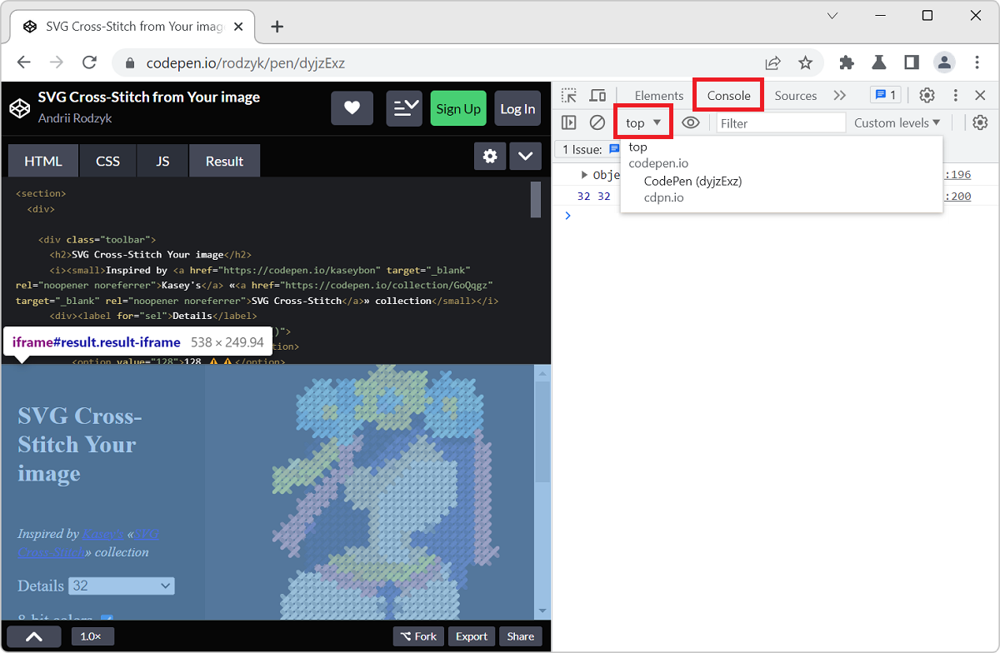

If the page you are working on contains an iframe which you want to inspect and debug, you can actually use DevTools to do so. This can be very useful when working with coding playground sites like [CodePen](https://codepen.io/), [JSFiddle](https://jsfiddle.net/), or [Glitch](https://glitch.com/).

### Firefox

Firefox has an iframe selector button in its toolbar that lets you select the iframe you want to inspect. Once selected, the **Inspector** and **Console** tools will be scoped to the iframe you selected. This means that you will only see the DOM tree and the console messages for the iframe you selected. This also means that any JavaScript expression you execute in the **Console** tool will be executed in the context of the iframe.

1. Open Firefox DevTools.
1. In the main toolbar, click **Select an iframe as the currently targeted document**.
1. Select the iframe you want to inspect.

### Chrome, Edge, Safari

Chromium-based browsers and Safari have a **JavaScript context** selector button located in the **Console** tool which allows you to select the iframe you want to execute JavaScript expressions in. This button does not change what's visible in the **Elements** tool, it only changes the JavaScript context in which the **Console** tool works.

1. Open DevTools.
1. Open the **Console** tool.
1. In the **Console** toolbar, click **JavaScript context**.
1. Select the context you want to execute JavaScript expressions in.

