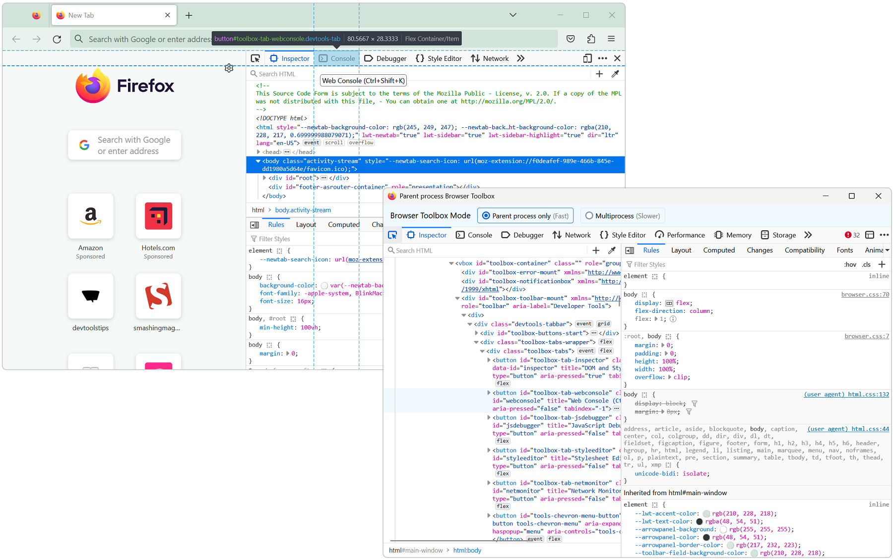

The user interface of DevTools is built with HTML, CSS, and JavaScript. This means you can inspect and debug DevTools with DevTools.

### Chromium

To debug DevTools in Chromium-based browsers, such as Chrome or Edge:

1. Open DevTools on any browser tab.

1. Undock DevTools into a separate window.

1. Press <kbd>Ctrl+Shift+I</kbd> (<kbd>Cmd+Opt+I</kbd> on macOS) to open a second DevTools window.

    This second DevTools window now targets the first one. Anything you see in the **Elements** tool represents elements of the first DevTools window's user interface.

    

### Firefox

To debug DevTools in Firefox:

1. Open DevTools on any browser tab.

1. Open the **Settings** page by pressing <kbd>F1</kbd>.

1. Under **Advanced settings**, check the **Enable browser chrome and add-on debugging toolboxes** and **Enable remote debugging** checkboxes.

1. Now in the main Firefox toolbar, click **Open application menu** (the hamburger menu).

1. Click **More tools** > **Browser Toolbox**.

    A new DevTools window appears. This one inspects the entire Firefox browser window. The elements you see in the **Inspector** tool represent elements of the Firefox user interface, including its DevTools.

    
