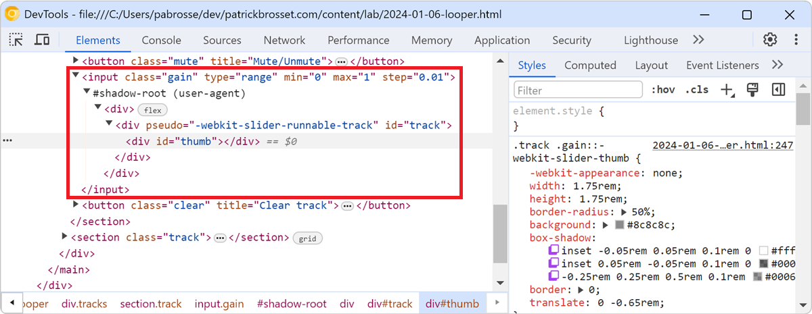
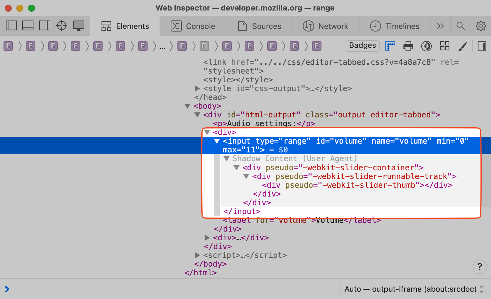

Browsers often add elements to the DOM of your web pages on top of the ones you, yourself, defined. For example, when you create a `<video>` element, the browser creates a bunch of nested DOM nodes within it to display the controls, the progress bar, etc. When you use a `<input type="range">` element, the browser also creates a nested DOM nodes to display the track and the thumb.

This is called the user-agent DOM. It's called like this because it's the DOM that the user-agent (or browser) creates for you. It's not part of the HTML code of your webpage, and it's also not visible to you in DevTools by default or accessible via JavaScript. It is useful, however, to know that it exists, and sometimes it can be useful to inspect it.

For example, in Chromium-based browsers, you can style the thumb in an `<input type="range">` element using the [`::-webkit-slider-thumb`](https://developer.mozilla.org/docs/Web/CSS/::-webkit-slider-thumb) pseudo-element. But by default, you can't inspect the thumb in DevTools.

To display user-agent DOM nodes in DevTools, and therefore inspect and style it:

* In Firefox:

  1. Open a new tab and type `about:config` in the address bar.
  1. Search for `devtools.inspector.showAllAnonymousContent` and set it to `true`.
  1. Open DevTools, and open the **Inspector** tool.
  1. Select the element you want to inspect, for example an `<input type="range">` element.
  1. Expand the element to inspect the DOM nodes generated by the browser for this element.

* In Chrome, Edge, or other Chromium-based browsers:

  1. Open DevTools.
  1. Go to the **Settings** by pressing <kbd>F1</kbd>.
  1. Find the **Show user agent shadow DOM** checkbox and select it.
  1. Close the **Settings**.
  1. Open the **Elements** tool.
  1. Select the element you want to inspect, for example an `<input type="range">` element.
  1. Expand the element to inspect the DOM nodes generated by the browser for this element.

* In Safari:

  1. User-agent DOM is available as part of the DOM by default without needing to enable any additional setting.
  2. To inspect, expand the element, for example an `<input type="range">` element.
  3. User-agent DOM is visible under the **Shadow Content (User Agent)** section.

