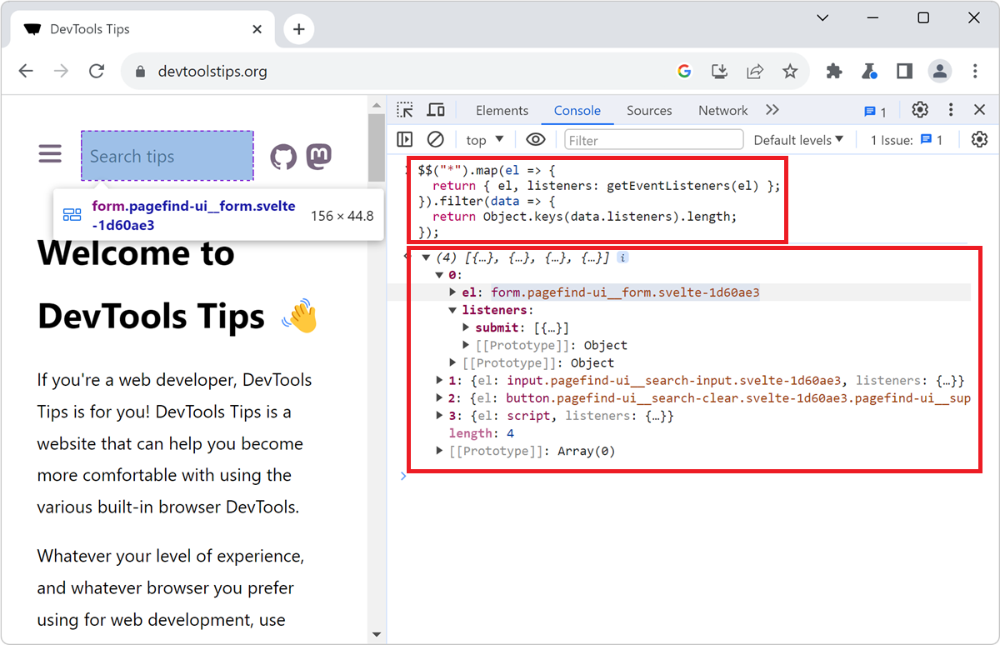

When you don't know a codebase, it might be hard to know where to get started, and what events are being listened to by which elements.

The **Console** tool, in Chromium-based browsers, comes with a nice utility function named `getEventListeners` which returns all of the listeners attached to a given element. If we combine this with the `$$` utility function, we can get a list of all elements on the page, and their listeners.

The following code snippet will return an array of objects, each containing an element and its listeners. It also filters out all of the elements that don't have any listeners attached to them.

```javascript
$$("*").map(el => {
  return { el, listeners: getEventListeners(el) };
}).filter(data => {
  return Object.keys(data.listeners).length;
});
```

So, to list all elements that have listeners on a page:

1. Open the **Console** tool, by pressing <kbd>Ctrl+Shift+J</kbd> on Windows or Linux, or <kbd>Command+Option+J</kbd> on macOS.

1. Paste the code snippet above in the **Console**, and press <kbd>Enter</kbd>.

1. The list of all elements with listeners is displayed in the **Console**.

