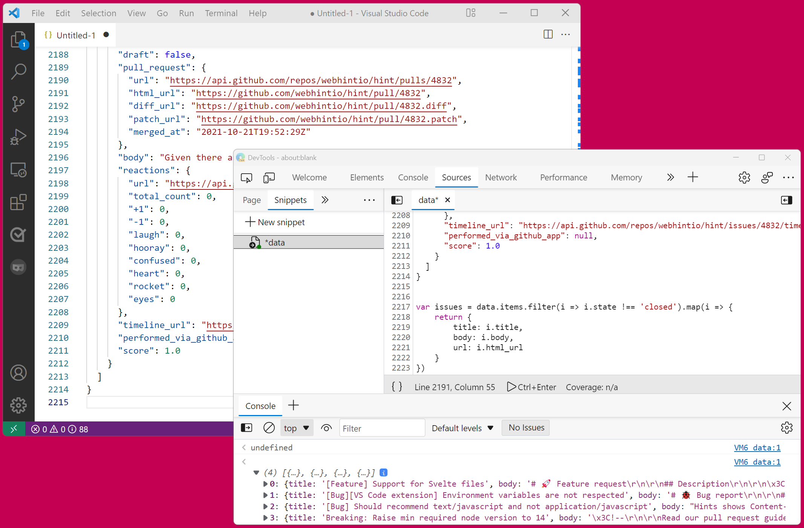

I often work with large amount of data that I need to go through and gather interesting information from. Sometimes this data is in JSON format. When that's the case, I like using DevTools to turn it into what I want, using JavaScript!

* I copy the JSON data content from a text editor.
* I open the **Snippet** pane in the **Sources** tool ([learn more about snippets](./use-scripts-as-snippets.md)).
* I paste the data in a new snippet, work on it with JavaScript to extract what I need (usually using array functions like `map` and `filter`).
* Finally I extract the data again using the `copy` function, and paste it back into my text editor ([learn more about copy](./copy-from-console.md)).

Take a look at the following video to see my workflow in action:

https://www.youtube.com/watch?v=W8s9UiEhaLE

Note that while the workflow works in every browser, the **Snippets** pane only exists in Edge and Chrome. In Firefox, you can use the [multi-line console](./multi-line-console.md) to do the same thing.

