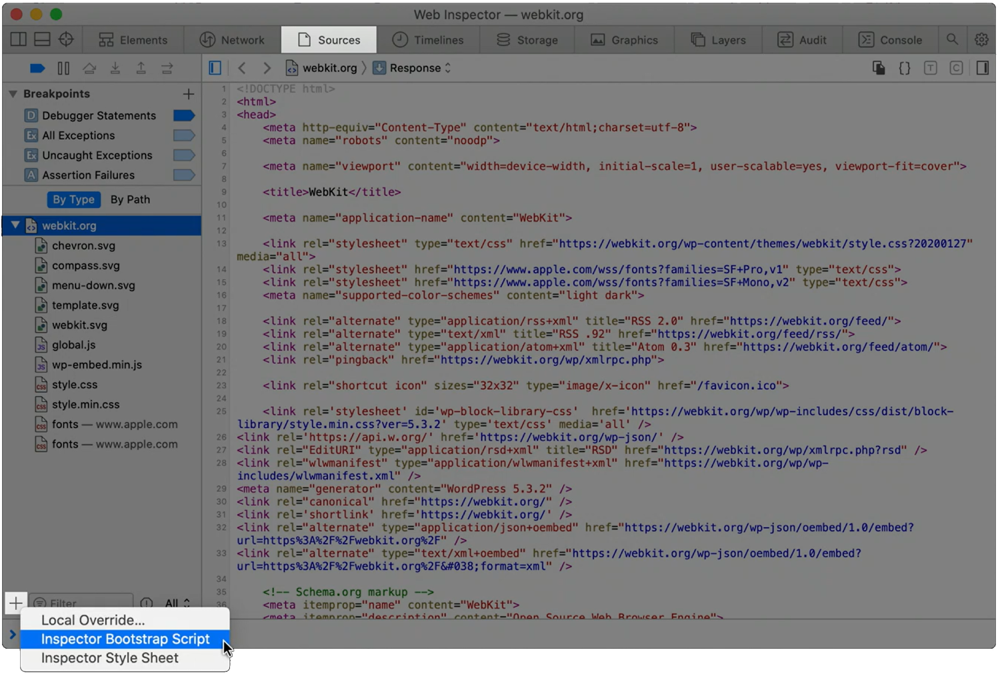

When a page loads, and all of its global objects are ready, but before the JavaScript code of the page actually kicks-in, is a great time to inject debugging code. For example, it might be useful to replace global functions with ones that contain altered code.

Safari lets you do this by creating an **Inspector Bootstrap Script**. This script is guaranteed to run after JavaScript global objects have been created, as long as DevTools is opened.

To create a bootstrap script:

1. Open the **Sources** tool
1. At the bottom of the sidebar, click **Add resource** (`+`).
1. Choose the **Inspector Bootstrap Script** type.
1. Write the code you need.

To learn more, see [Inspector Bootstrap Script](https://webkit.org/web-inspector/inspector-bootstrap-script/) on the webkit blog.
