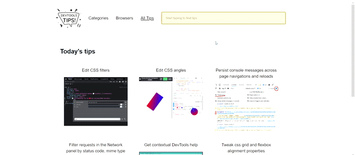

Simple, yet powerful, `* { outline: 1px solid red; }` is a useful debugging trick that helps understanding the page structure, finding overflow bugs or understand why elements are being pushed away for no apparent reason.

In Edge, Chrome, Firefox and Safari:

* Go to the Elements panel (in Chrome, Edge or Safari) or Inspector panel (in Firefox).
* Click the `+` (new style) icon in the Styles or Rules sidebar.
* Add the rule  `{ outline: 1px solid red; }` to the CSS Selector `*`.

In Polypane:

* Press `ctrl/cmd + d` to automatically add outlines around all elements.

And voila! All elements are outlined and you can understand what's going on.

