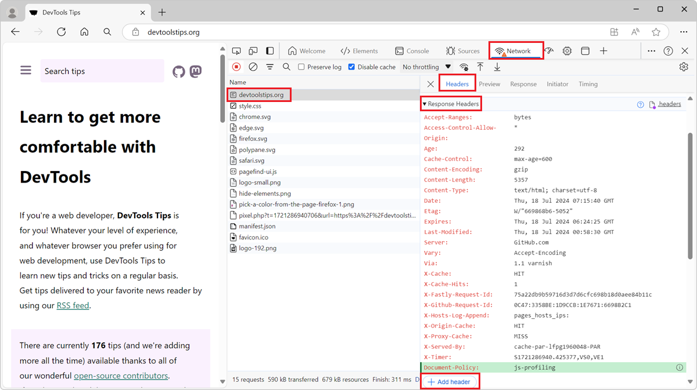

With DevTools, you can override the response headers of a network request and test your website under different conditions.

HTTP response headers are metadata sent by the server to the browser, along with a response such as an HTML page, or a JS, CSS, or image resource. These headers control how the browser handles the response, such as caching, content type, and various features or security settings.

Overriding response headers from within DevTools means that you can test all of these aspects without needing to modify the server, which can be useful when you don't have access to the server, or to do quick tests.

For example, the JS self-profiling API allows you to run a JavaScript profiler, programmatically, on your website, and requires the `Document-Policy: js-profiling` header to be set. If you want to test your JS self-profiling code locally, without adding the header to your server, override the response header in DevTools:

1. Open Chrome or Edge DevTools, and go to the **Network** tool.

1. Reload the page.

1. Find the request for which you want to override the response headers. In the example above, you would look for the initial HTML request.

1. Right-click on the request and select **Override headers**.

   The **Headers** tab appears in the side panel, with a list of existing response headers under the section **Response Headers**.

1. To add a new header, click the **+ Add header** button.

   A new row appears in the list of headers, where you can enter the name and value of the header you want to add.

1. Enter a header name, such as `Document-Policy`, and a value, such as `js-profiling`.

1. To edit an existing header, click on the header value and enter a new value.

1. Reload the page.

   The resource for which you overrode the headers should now be loaded with the new headers.

