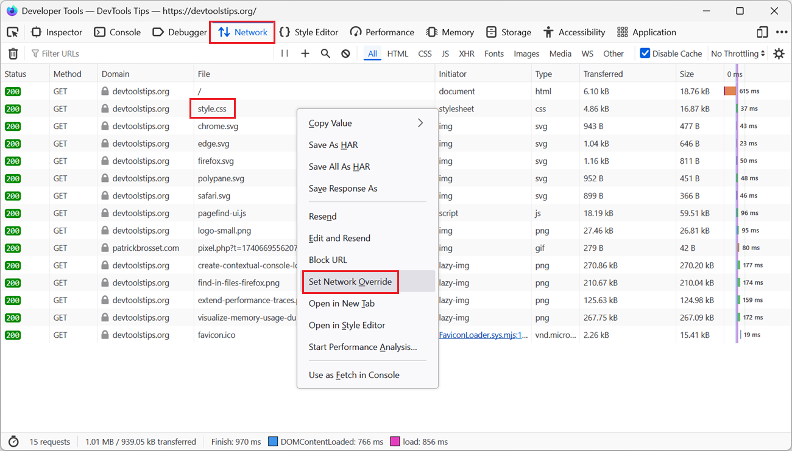
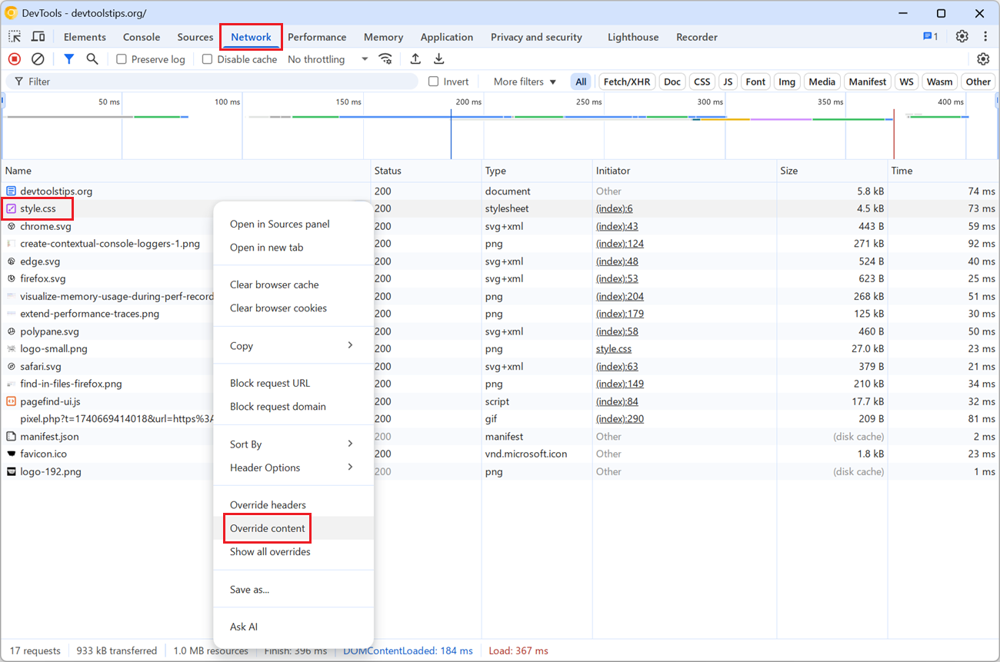

To test a quick fix locally, in DevTools, without editing the source file and deploying it to a server, override network responses with local files.

## Firefox

1. Open the **Network** tool.

1. Find the request which you want to override.

1. Right-click the request and select **Set Network Override**.

1. Choose a location on your computer to save the response.

   The current response to the request is saved to that location.

1. Open the local file in a text editor, make the necessary changes, and save the file.

1. Reload the page.

   DevTools now uses the local file, with your modifications, as the response instead of the original server response.

To remove the override, right-click the request again and select **Remove Network Override**.

## Chrome and Edge

1. Open the **Network** tool.

1. Find the request which you want to override.

1. Right-click the request and select **Override content**.

1. In the banner that appears at the top of DevTools, click **Select folder**

1. Choose a location on your computer to save the response, and click **Allow** to let DevTools access the folder.

   A new folder, matching the website's domain name, is created at that location, and the current response to the request is saved in that folder.

1. Open the local file in a text editor, make the necessary changes, and save the file.

1. Reload the page.

   DevTools now uses the local file, with your modifications, as the response instead of the original server response.

To remove the override:

1. Open the **Sources** tool.

1. In the left pane, click **Overrides**.

1. To temporarily disable the override, clear the **Enable Local Overrides** checkbox.

1. To permanently remove the override, click **Clear configuration**.

