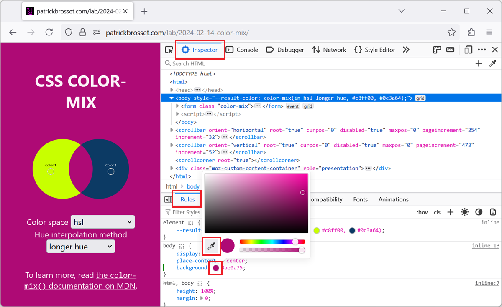

When working with the CSS of a webpage, from the **Elements** or **Inspector** tool, in DevTools, there may be times when you want to reuse a existing color from the webpage, or from the screen, but might not know the exact color value. This can happen, for example, in cases when the color you want to pick is part of an image.

To copy the color value from a pixel on the inspected webpage, or on the entire screen, use the **Eye Dropper** tool in DevTools.

## In Firefox

In Firefox, you can use the **Eye Dropper** tool in two ways: either to copy a color to the clipboard, or to change a color in the CSS code displayed in the **Rules** tab.

### Copy a color to the clipboard

1. Open DevTools and go to the **Inspector** tool.

1. Click the **Grab a color from the page** button, that's located in the **Inspector** toolbar, above the DOM tree panel.

   The **Eye Dropper** tool appears in the page.

1. Move your cursor over the webpage to find the color you want to copy, and then click.

   The color value is copied into your clipboard.

### Change a color in the CSS code

1. Open DevTools and go to the **Inspector** tool.

1. Find the CSS color value you want to change in the **Rules** tab.

1. Click the colored circle next to the color value.

   The **Color Picker** dropdown appears.

1. Click the **Eye Dropper** icon that's displayed in the bottom left corner of the **Color Picker** dropdown.

   The **Eye Dropper** tool appears in the page.

1. Move your cursor over the webpage to find the color you want to use, and then click.

   The color value that's displayed in the **Rules** tab is changed to match the color you selected.

## In Chrome, Edge, and Safari

Chrome and Edge don't have a way to copy a color to your clipboard. They only support using the **Eye Dropper** tool to change a color displayed in the CSS code in the **Styles** pane. However, these browsers support grabbing a color from the _entire screen_, not just the webpage.

1. Open DevTools and go to the **Elements** tool.

1. Find the CSS color value you want to change in the **Styles** pane.

1. Click the colored square next to the color value.

   The **Color Picker** dropdown appears.

1. Click the **Eye Dropper** icon in the **Color Picker** dropdown.

   Your cursor changes into the **Eye Dropper** tool.

1. Move your cursor over the webpage or the screen to find the color you want to use, and then click.

   The color value that's displayed in the **Styles** pane is changed to match the color you selected.

## In Polypane

1. Open Polypane.

1. Click the **Eye Dropper** icon in the browser top toolbar.

   Your cursor changes into the **Eye Dropper** tool.

1. Move your cursor over the Polypane UI or over the screen to find the color you want to use, and then click.

   The **Eye Dropper** UI appears, showing the selected color, as well previously selected colors, and contrast ratio information.

