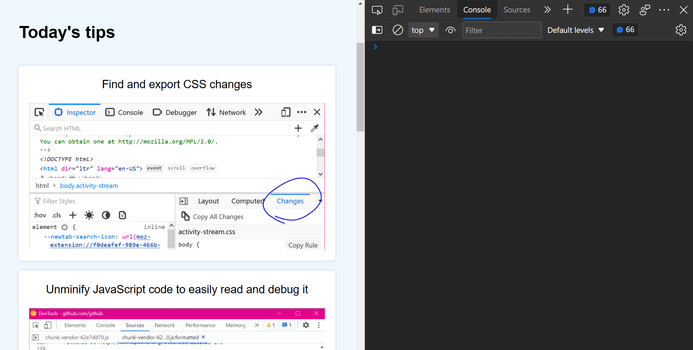

When creating or modifying a design prototype for the web, you may want to quickly edit content in the browser without having to find the relevant code.

When you turn on `designMode` for the document or a given element, all associated text becomes editable directly in the browser. Images and other page content can be deleted, too. This is a quick way to prototype design changes such as seeing how a page responds to very long or very short headline copy.

`designMode` is not a DevTools-specific feature, as it is defined as part of the [Web API](https://developer.mozilla.org/en-US/docs/Web/API/Document/designMode). However, toggling `designMode` via the DevTools Console is a convenient way to temporarily make the page editable.

* Open the Console
* Enter `document.designMode="on"` and press Enter

Turn off `designMode` with the expression `document.designMode="off"`.

In Polypane these steps are not neede and it's enough to open the **Debug tools** and activating **Edit content**.

Changes are not persisted and will revert on page close or refresh.

