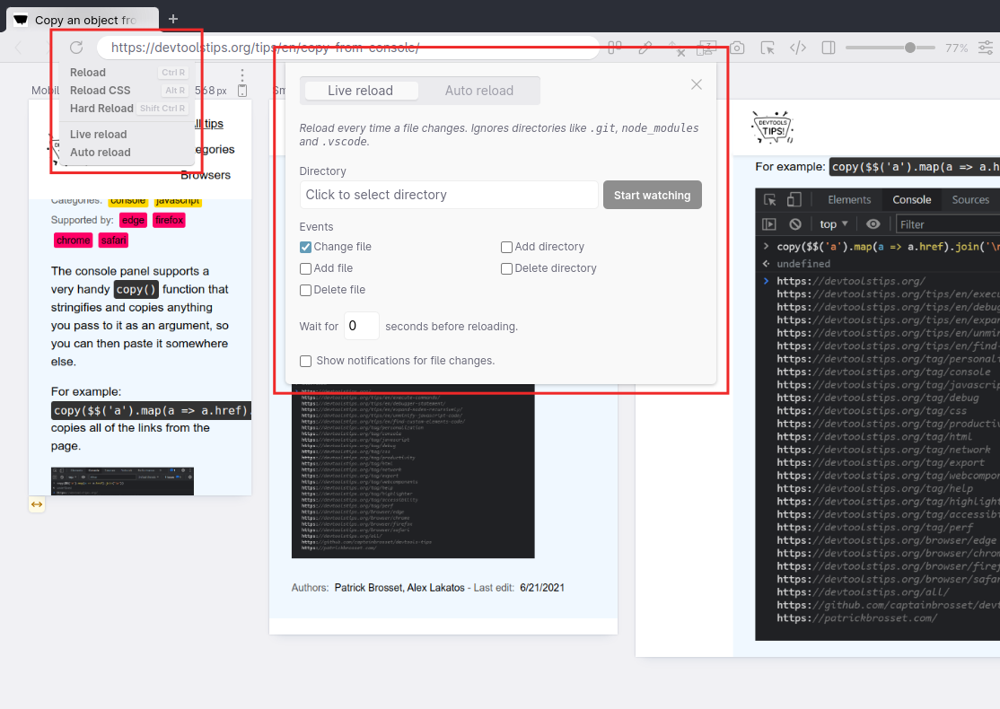

While working on a page locally and you're not using a hot reloading dev server, you need to reload the browser yourself to see the change. You need to do this every time you save a file. Wouldn't it be great if this happened automatically?

Polypane contains a **Live reload** panel that lets you target a folder, and any change in that folder will either reload the page, or replace just the CSS or image file that you changed without reloading the rest of the page. This way you wont have to leave your code editor even when working on a plain HTML or CSS file and the browser will keep up to date.

Open the **Live Reload** panel:

1. Right-click the **reload** button.
2. Select **Live reload**.
3. In the configuration screen (see screenshot below) select a directory and click **Start watching**.
4. The reload button will show a lightning bolt when live reloading is active.

There are specific options to tweak, like which file system events to listen for, how long to wait before reloading (to account for things like SASS compilation time) and whether to show notifications of which files changed. [Learn more here](https://polypane.app/docs/live-auto-reloading/).
