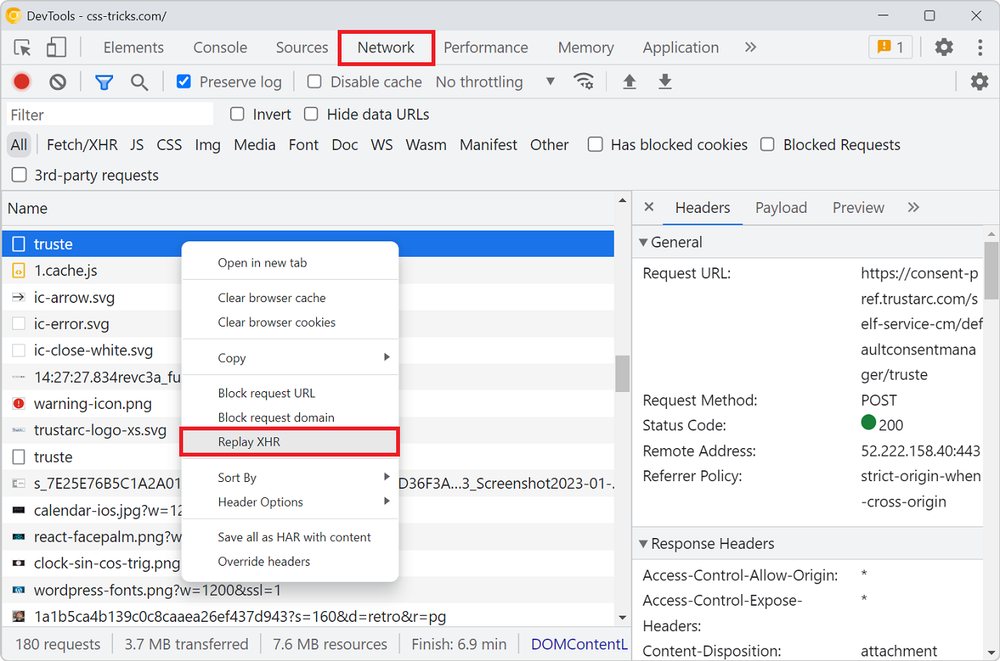

When you're debugging an XHR request to a backend service that doesn't respond with the right things it can be useful to send the request over and over again. Reloading the entire page to do so is tedious.

In Chrome or Edge DevTools, you can simply replay the same XHR request:

1. Open the **Network** tool.
1. Find the XHR request in the list that you want to resend. Note that this only works with XHR requests, and not Fetch requests.
1. Right-click the request and click **Replay XHR**.

**Note**: you can also edit the request before resending it! To learn more, see [Edit and resend faulty network requests to debug them](./edit-and-resend-network-requests.md).

