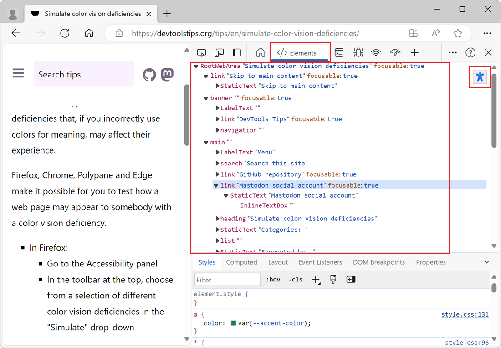

The accessibility tree is a representation of the structure of a web page that is used by assistive technologies such as screen readers. It is similar to the DOM tree, but it only includes the elements that are relevant for accessibility. For example, it includes text nodes, links, images, or form controls, but not generic elements such as `
` or ``.

It's best to actually use a screen reader, or another assistive technology, to experience how your webpage is perceived by users with disabilities. But, it can sometimes be useful to see the accessibility tree in DevTools to understand how a page is structured.

## Firefox

Firefox has a dedicated **Accessibility** tool. To open it:

1. Press <kbd>F12</kbd> to open DevTools.
1. In the main toolbar, click the **Accessibility** tab.
1. Expand the **document** node that's displayed in the tool to reveal the accessibility tree.

Supported features include:

* Hovering over nodes in the tree highlights the corresponding DOM elements in the page.
* Selecting nodes reveals their accessibility properties in the sidebar.
* Accessibility issues are displayed next to the corresponding nodes in the tree.
* Checking for more issues, tabbing order, or simulating color vision deficiencies from the toolbar.

## Chrome and Edge

Chrome and Edge have an option to display the accessibility tree in the **Elements** tool, instead of the DOM tree. To enable it:

1. Press <kbd>F12</kbd> to open DevTools.
1. Go to the **Settings** panel by pressing <kbd>F1</kbd>.
1. In the sidebar, click **Experiments**.
1. Find the **Enable full accessibility tree view in the Elements panel** checkbox and select it.
1. Restart DevTools.

To see the accessibility tree in the **Elements** tool:

1. Open the **Elements** tool.
1. Click **Switch to Accessibility Tree View** in the top-right corner of the DOM tree.

Supported features include:

* Hovering over nodes in the tree highlights the corresponding DOM elements in the page.
* Selecting nodes reveals the matching CSS styles in the **Styles** pane and lets you update them.

