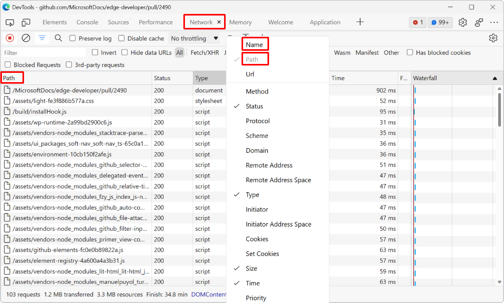

By default, the **Network** tool displays the name of each requested resource. For example, if a webpage requests an image from `https://mysite.com/assets/img/image.png` then the tool only displays `image.png` by default instead of the full file path.

## Chrome and Edge

In Chrome and Edge DevTools, you can see the full path instead, which can be useful to more easily identify resources in the request list:

* In the **Network** tool, right-click one of the table headers.
* In the list of columns, select **Path**, and deselect **Name**.

## Firefox

Firefox doesn't have a **Path** option, but you can display URLs instead:

* In the **Network** tool, right-click one of the table headers.
* In the list of columns, select **URL**, and deselect **File**.

Thank you [Ryan Staniforth](https://twitter.com/ryanstaniforth/) for [sharing this tip on Twitter](https://twitter.com/ryanstaniforth/status/1633620774744469506).
