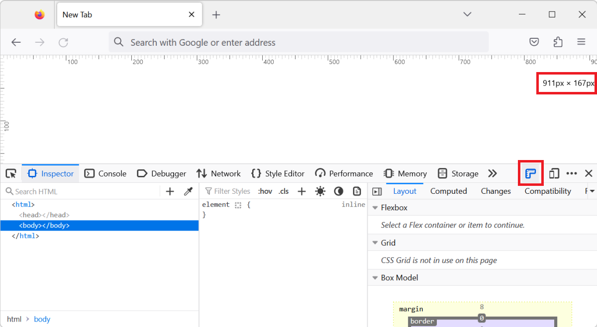
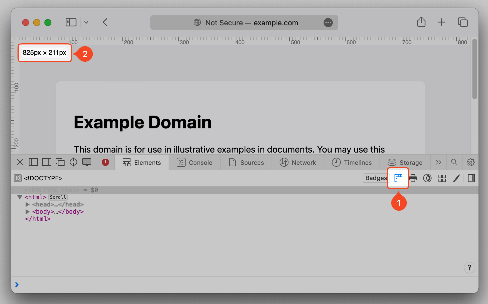
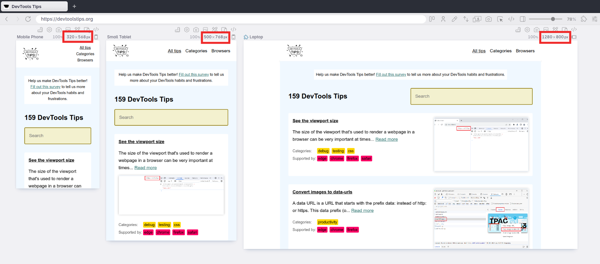

The size of the viewport that's used to render a webpage in a browser can be very important at times, such as when creating or debugging [media queries](https://developer.mozilla.org/docs/Web/CSS/CSS_media_queries/Using_media_queries).

You can easily know what the current size of the viewport is in DevTools. Here are two ways to do it.

## See the viewport size in the Console

To display the viewport size in the **Console** tool:

1. Open the **Console** tool in DevTools.
1. Enter `${document.documentElement.clientWidth} x ${document.documentElement.clientHeight}` in the prompt and press <kbd>Enter</kbd>.
   The size of the viewport, at the time you executed the expression, appears in the **Console**.

You can also use a _live expression_ to see the size of the viewport in real-time, as you resize the browser window. To learn more, see [Cut down on console noise using live expressions](./live-expressions.md).

## See the viewport size in the page

You can also see the size of the viewport⁕ in the page directly:

* In Chrome or Edge:

    1. Open DevTools.
    1. Focus your attention in the top-right corner of the webpage, and then resize the browser window (or the DevTools panel).
       The viewport size appears as a temporary overlay, in the top-right corner of the webpage:

       

* In Firefox:

    1. Open DevTools and go to the **Settings** panel (<kbd>F1</kbd>).
    1. Under **Available Toolbox Buttons**, select the **Toggle rulers for the page** setting.
       The **Toggle rulers for the page** icon appears in the DevTools toolbar.
    1. Click the ruler icon to display rulers in the webpage.
       In addition to the top and left rulers which now are visible in the webpage, the viewport size is displayed in an overlay, in the top-right corner of the webpage.

       

* In Safari:

    1. Open Web Inspector and go to the **Elements** tool.
    1. Hover over any node displayed in the DOM tree of the tool.
       On hover, rulers and the viewport size appear in the page temporarily.
    1. You can also click the **Show rulers** icon in the toolbar of the **Elements** tool to make the rulers and viewport size overlay permanent.
 
       

* In Polypane:

    1. The dimensions of each viewport are always shown above it. Edit these values to update the viewport.
 
       

⁕ In browsers with classic scrollbars, the number shown in the page by DevTools doesn't account for the scrollbar width, if there is one. The actual viewport width is about 15 to 17 pixels small than the number shown.
